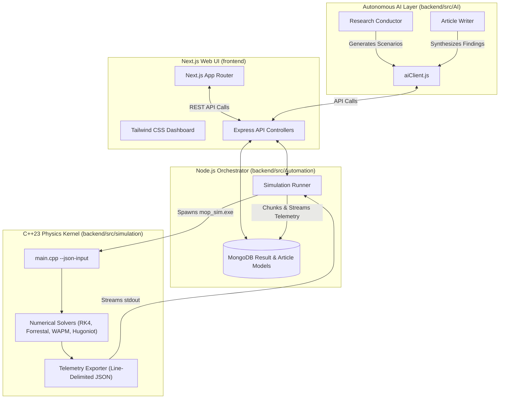
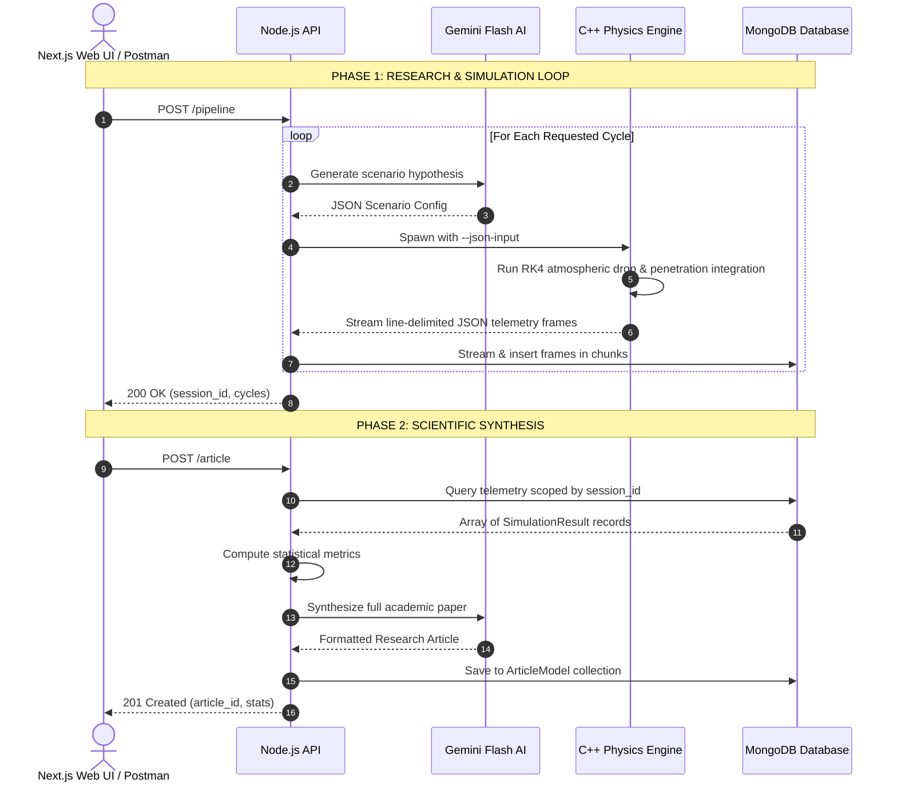

```
  _________________________________________________________________________________________
 /                                                                                         \
|  [!] END-USER LICENSE AGREEMENT (EULA) & TERMS OF SERVICE [!]                             |
|                                                                                           |
|  WARNING: This software is a high-fidelity, advanced physics and penetration simulator.   |
|  Usage of this application is strictly restricted to recreational, educational, and       |
|  hobbyist purposes. Due to the extreme accuracy and sensitive nature of the simulated     |
|  models, any unauthorized, commercial, or malicious application may result in severe      |
|  legal consequences.                                                                      |
|                                                                                           |
|  DISCLAIMER OF WARRANTY: This software is provided "AS IS", without warranty of any       |
|  kind, express or implied.                                                                |
|  LIMITATION OF LIABILITY: In no event shall the author(s) be liable for any claim,        |
|  damages, or other liability arising from, out of, or in connection with the software     |
|  or the use or other dealings in the software.                                            |
|  By using this repository, you acknowledge that this tool is not certified for real-world |
|  engineering, defense analysis, or physical destructive testing.                          |
 \_________________________________________________________________________________________/
```

# MOP Simulator V3.5.0 - Autonomous AI Penetration Research Platform

// Copyright (c) 2026 Omid Teimory. All Rights Reserved


**MOP Simulator V3.5.0** has evolved from a standalone native binary into a **full-stack autonomous AI research platform**. It tightly couples a high-performance C++23 terminal ballistics simulation engine with a Node.js/Express backend API, Google Gemini AI integration, and a modern Next.js 16 Web UI.

The platform is designed to autonomously hypothesize target geometries, execute massive multi-scenario penetrations (e.g., GBU-57 MOP, BLU-109, Orbital Kinetic Strikes), stream and aggregate telemetry to a MongoDB database, and automatically synthesize the findings into peer-reviewed-quality academic research articles.

---

## 🚀 Architecture & Ecosystem



---

## ⚡ Complete End-to-End Workflow Demonstration

The platform operates through an automated two-phase research cycle:



---

## 🛠️ Installation & Setup

### Requirements

- **C++ Compiler**: GCC / MinGW-w64 with **C++23** support (`g++ >= 13.0`)
- **Node.js**: v20 or higher
- **Database**: MongoDB instance (local or Atlas)

### 1. Build the C++ Simulation Engine

```powershell
# Open terminal in project root and navigate to the backend
cd backend
mingw32-make clean; mingw32-make
```

### 2. Setup Node.js Backend & AI Environment

```powershell
# Still in the backend directory
npm install

# Create a .env file in the Automation directory and add credentials
echo "MONGO_URI=mongodb://127.0.0.1:27017/mop-simulator" > src/Automation/versionOne/.env
echo "GEMINI_API_KEY=your_gemini_api_key_here" >> src/Automation/versionOne/.env
echo "TEST=false" >> src/Automation/versionOne/.env
echo "PORT=3000" >> src/Automation/versionOne/.env
```

### 3. Start the Backend API

```powershell
# Inside backend directory
npm start
```
The server will run on `http://localhost:3000`. 

### 4. Setup and Start the Next.js Frontend

Open a new terminal window:
```powershell
# Navigate to the frontend directory
cd frontend
npm install
npm run dev
```
Open `http://localhost:3000` (or the port Next.js binds to, typically 3001 if backend is on 3000) in your browser to see the simulator UI!

---

## 🔬 Core Physics & Mathematical Framework

The native C++ simulation engine remains the heart of the project, integrating continuum mechanics, cavity expansion theory, and Hugoniot shock impedance matching.

### 1. Cavity Expansion & Deceleration Model (Two-Phase Forrestal)

For penetration into reinforced concrete and geological strata, the deceleration force $F_z$ is governed by cavity expansion dynamics:

$$ F_z = -\frac{\pi D^2}{4} \left( S f_c' + N \rho_t v^2 \right) $$

Where:
- $D$: Projectile diameter ($m$)
- $f_c'$: Dynamic Increase Factor (CEB-FIP DIF) adjusted compressive strength
- $S$: Empirical target strength multiplier ($S = 82.6 \cdot (f_c')^{-0.544}$)
- $N$: Nose shape coefficient ($\text{CRH}$)
- $\rho_t$: Target material density ($kg/m^3$)
- $v$: Instantaneous velocity ($m/s$)

### 2. Walker-Anderson Hydrodynamic Rod Erosion (WAPM)

At hypervelocity speeds ($v > 1200\ m/s$), when dynamic pressures exceed casing yield strength ($P_{dyn} > Y_p$). Interface velocity $u$ is given by Tate-Bernoulli:

$$ Y_p + \frac{1}{2} \rho_p (v - u)^2 = R_t + \frac{1}{2} \rho_t u^2 $$

### 3. Walker-Wasley Hugoniot Shock Initiation

Explosive shock initiation is evaluated by impedance matching shock Hugoniot jump conditions:

$$ U_s = C_0 + S U_p, \quad P = \rho_0 U_s U_p $$

Transmitted shock stress $P_{shock}$ and casing transit pulse duration $\tau$ evaluate critical initiation energy $P^2 \tau \ge E_c$.

---

## 🔮 Machine Learning Vision (V4.0)

See `backend/src/MachineLearning/versionOne/MachineLearning.md` for full architectural plans:
- **Surrogate Neural Physics**: Replacing heavy RK4 integration loops with $O(1)$ Deep Neural Networks (DNN) via **LibTorch (PyTorch C++)**.
- **Reinforcement Learning Smart Fuze (RL)**: Microsecond-precision detonation triggering based on real-time $g$-force and shock pressure feedback.

---

## 📜 License & Copyright

**Copyright (c) 2026 Omid Teimory. All Rights Reserved.**

Licensed under the GNU Affero General Public License v3.0 (AGPLv3). See `LICENSE` for details.
