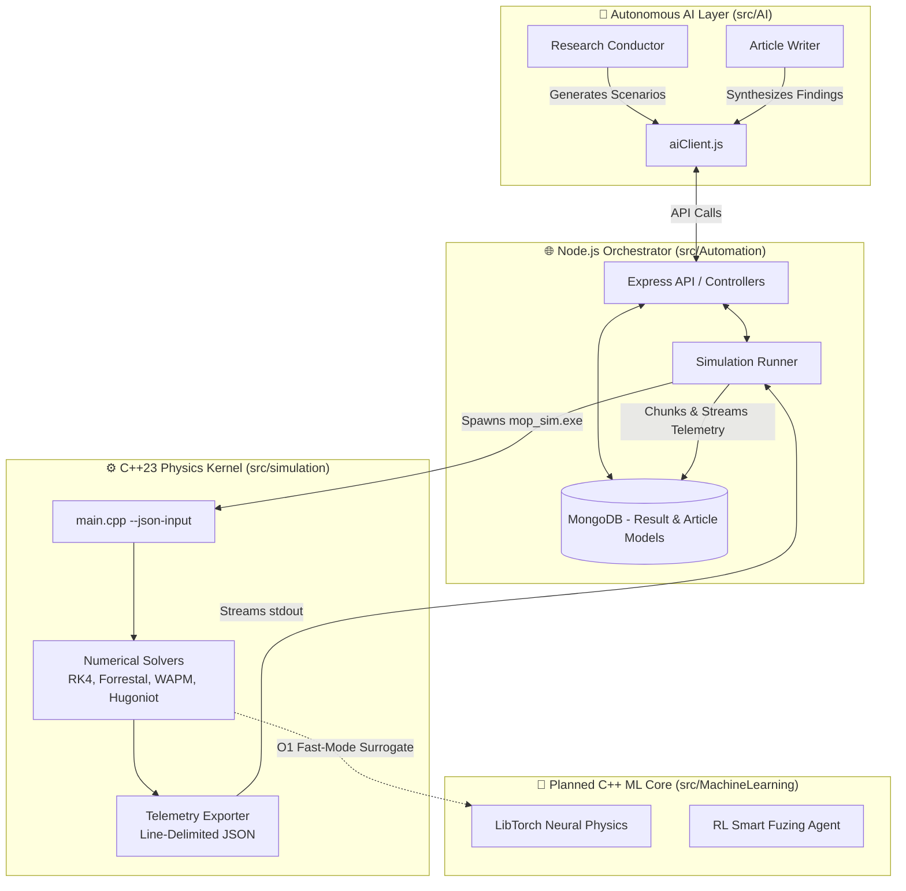
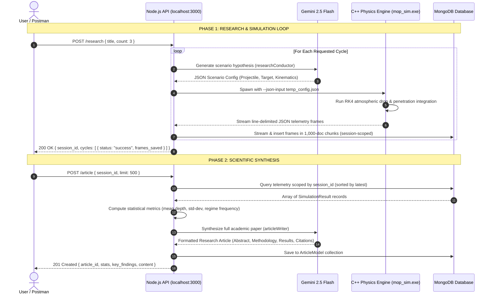

```
  _________________________________________________________________________________________
 /                                                                                         \
|  [!] END-USER LICENSE AGREEMENT (EULA) & TERMS OF SERVICE [!]                             |
|                                                                                           |
|  WARNING: This software is a high-fidelity, advanced physics and penetration simulator.   |
|  Usage of this application is strictly restricted to recreational, educational, and       |
|  hobbyist purposes. Due to the extreme accuracy and sensitive nature of the simulated     |
|  models, any unauthorized, commercial, or malicious application may result in severe      |
|  legal consequences.                                                                      |
|                                                                                           |
|  DISCLAIMER OF WARRANTY: This software is provided "AS IS", without warranty of any       |
|  kind, express or implied.                                                                |
|  LIMITATION OF LIABILITY: In no event shall the author(s) be liable for any claim,        |
|  damages, or other liability arising from, out of, or in connection with the software     |
|  or the use or other dealings in the software.                                            |
|  By using this repository, you acknowledge that this tool is not certified for real-world |
|  engineering, defense analysis, or physical destructive testing.                          |
 \_________________________________________________________________________________________/
```

# MOP Simulator V3.0 - Autonomous AI Penetration Research Platform

// Copyright (c) 2026 Omid Teimory. All Rights Reserved


**MOP Simulator V3.0** has evolved from a standalone native binary into a **full-stack autonomous AI
research platform**. It tightly couples a high-performance C++23 terminal ballistics simulation
engine with a Node.js/Express automation backend and advanced LLM AI integration (Google Gemini 2.5
Flash).

The platform is designed to autonomously hypothesize target geometries, execute massive
multi-scenario penetrations (e.g., GBU-57 MOP, BLU-109, Orbital Kinetic Strikes), stream and
aggregate telemetry to a MongoDB database, and automatically synthesize the findings into
peer-reviewed-quality academic research articles.

---

## 🚀 Architecture & Ecosystem



---

## ⚡ Complete End-to-End Workflow Demonstration

The platform operates through an automated two-phase research cycle:



---

### Step 1: Run Autonomous Simulation Campaign (`POST /research`)

Trigger an autonomous simulation campaign by supplying a research title and the number of desired
execution cycles.

**Endpoint:** `POST http://localhost:3000/research`  
**Headers:** `Content-Type: application/json`  
**Request Payload:**

```json
{
	"title": "Optimizing Casing Thickness for 70MPa Concrete",
	"description": "Parametric evaluation of GBU-57 MOP casing wall thickness variations against ultra-high performance reinforced concrete bunkers.",
	"count": 3
}
```

**Real Response (`200 OK`):**

```json
{
	"data": {
		"message": "Autonomous cycles finished",
		"session_id": "a4f8b91c",
		"cycles": [
			{ "cycle": 1, "frames_saved": 1240, "status": "success" },
			{ "cycle": 2, "frames_saved": 1185, "status": "success" },
			{ "cycle": 3, "frames_saved": 1210, "status": "success" }
		]
	}
}
```

---

### Step 2: Synthesize Academic Research Article (`POST /article`)

Once the simulation telemetry is populated in MongoDB, request the AI Article Writer to synthesize
the full publication.

**Endpoint:** `POST http://localhost:3000/article`  
**Headers:** `Content-Type: application/json`  
**Request Payload:**

```json
{
	"session_id": "a4f8b91c",
	"limit": 500
}
```

**Real Response (`201 Created`):**

```json
{
	"data": {
		"article_id": "6a85591eea0eecc59e063895",
		"title": "Optimizing Casing Thickness for 70MPa Concrete",
		"session_id": "a4f8b91c",
		"word_count": 1406,
		"scenarios_analyzed": 6,
		"stats": {
			"totalScenarios": 6,
			"avgPenetrationDepth": "8.22",
			"maxPenetrationDepth": "10.27",
			"minPenetrationDepth": "6.17",
			"stdDevPenetration": "2.05",
			"avgVelocity": "537.4",
			"avgMach": "1.58",
			"avgEnergyGJ": "1.960",
			"avgShockPressureGPa": "3.620",
			"casingFailureRate": "0.0",
			"erosionRate": "0.0",
			"dominantRegime": "Rigid Penetration (Crater+Tunnel)",
			"regimeDistribution": {
				"Rigid Penetration (Crater+Tunnel)": 6
			}
		},
		"key_findings": [
			"Mean penetration depth: 8.22 m (σ = 2.05 m)",
			"Dominant regime: Rigid Penetration (Crater+Tunnel) in 100.0% of scenarios",
			"Casing integrity maintained in 100% of scenarios",
			"Maximum sequential breach depth: 10.27 m",
			"Hydrodynamic erosion onset in 0.0% of scenarios",
			"Average impact velocity: 537.4 m/s at Mach 1.58"
		],
		"content": "# Optimizing Casing Thickness for 70MPa Concrete\n\n**MOP Simulator Autonomous Research Division**\n**Date:** August 19, 2026\n**Simulation Engine:** MOP Impact Physics & Penetration Simulator v2.8\n**Total Scenarios:** 6\n\n---\n\n## Abstract\n\nThis study presents a high-fidelity computational analysis of optimizing casing thickness for 70mpa concrete conducted through 6 autonomous simulation cycles using the MOP Impact Physics & Penetration Simulator v2.8..."
	}
}
```

---

## 🔮 Machine Learning Vision (V4.0)

See
[src/MachineLearning/MachineLearning.md](file:///h:/Omid/Code/MOP-Simulator/src/MachineLearning/MachineLearning.md)
for full architectural plans:

- **Surrogate Neural Physics**: Replacing heavy RK4 integration loops with $O(1)$ Deep Neural
  Networks (DNN) via **LibTorch (PyTorch C++)**.
- **Reinforcement Learning Smart Fuze (RL)**: Microsecond-precision detonation triggering based on
  real-time $g$-force and shock pressure feedback.

---

## 🔬 Core Physics & Mathematical Framework

The native C++ simulation engine remains the heart of the project, integrating continuum mechanics,
cavity expansion theory, and Hugoniot shock impedance matching.

### 1. Cavity Expansion & Deceleration Model (Two-Phase Forrestal)

For penetration into reinforced concrete and geological strata, the deceleration force $F_z$ is
governed by cavity expansion dynamics:

$$ F_z = -\frac{\pi D^2}{4} \left( S f_c' + N \rho_t v^2 \right) $$

Where:

- $D$: Projectile diameter ($m$)
- $f_c'$: Dynamic Increase Factor (CEB-FIP DIF) adjusted compressive strength
- $S$: Empirical target strength multiplier ($S = 82.6 \cdot (f_c')^{-0.544}$)
- $N$: Nose shape coefficient ($\text{CRH}$)
- $\rho_t$: Target material density ($kg/m^3$)
- $v$: Instantaneous velocity ($m/s$)

### 2. Walker-Anderson Hydrodynamic Rod Erosion (WAPM)

At hypervelocity speeds ($v > 1200\ m/s$), when dynamic pressures exceed casing yield strength
($P_{dyn} > Y_p$). Interface velocity $u$ is given by Tate-Bernoulli:

$$ Y_p + \frac{1}{2} \rho_p (v - u)^2 = R_t + \frac{1}{2} \rho_t u^2 $$

### 3. Walker-Wasley Hugoniot Shock Initiation

Explosive shock initiation is evaluated by impedance matching shock Hugoniot jump conditions:

$$ U_s = C_0 + S U_p, \quad P = \rho_0 U_s U_p $$

Transmitted shock stress $P_{shock}$ and casing transit pulse duration $\tau$ evaluate critical
initiation energy $P^2 \tau \ge E_c$.

---

## 🌐 Interactive 3D WebGL Physics Visualizer

The C++ engine natively exports `3d_visualizer.html`, providing:

- **100% Physics WebGL Rendering**: Driven frame-by-frame by telemetry.
- **US Standard Atmosphere 1976**: Inverse transform sampled sky dust particles based on barometric
  density.
- **Prandtl-Glauert Supersonic Shock Cones**: $\sin(\alpha) = 1/M$ attached in 3D matrix sync with
  the velocity vector.
- **Planck Blackbody Thermal Radiation**: Friction work elevates casing temperature. Radiation
  emission follows Planck's Law, shifting colors dynamically from dull red ($800\text{ K}$) to
  plasma ($2200\text{ K}+$).

---

## 🛠️ Installation & Setup

### Requirements

- **C++ Compiler**: GCC / MinGW-w64 with **C++23** support (`g++ >= 13.0`)
- **Node.js**: v20 or higher
- **Database**: MongoDB instance (local or Atlas)

### 1. Build the C++ Simulation Engine

```powershell
# Open terminal in project root
mingw32-make clean; mingw32-make
```

### 2. Setup Node.js & AI Environment

```powershell
cd src/Automation

# Install dependencies
npm install

# Create a .env file and add credentials
echo "MONGO_URI=mongodb://127.0.0.1:27017/mop-simulator" > .env
echo "GEMINI_API_KEY=your_gemini_api_key_here" >> .env
```

### 3. Start the Platform

```powershell
# Inside src/Automation
npm start
```

The server will run on `http://localhost:3000`. You can now hit the `/research` and `/article` REST
endpoints in Postman!

---

### Automation log sample

MongoDB connected Server running on http://localhost:3000 [Research Loop] Initiating 5 autonomous
cycles for: Effectiveness of Operation Midnight Hammer: Multi-Strike Ordnance Penetration Dynamics
(Session: 4e2a4577)

--- [Research Loop] Starting Cycle 1 of 5 --- [AI Client] Generating scenario for topic:
Effectiveness of Operation Midnight Hammer: Multi-Strike Ordnance Penetration Dynamics (Cycle 1/5)
[Research Loop] Spawning C++ Physics Simulator... [SimulationRunner] Spawning C++ engine:
H:\Omid\Code\MOP-Simulator\bin\mop_sim.exe --json-input [SimulationRunner] Process exited with
code 0. Total frames saved: 2

--- [Research Loop] Starting Cycle 2 of 5 --- [AI Client] Generating scenario for topic:
Effectiveness of Operation Midnight Hammer: Multi-Strike Ordnance Penetration Dynamics (Cycle 2/5)
[Research Loop] Spawning C++ Physics Simulator... [SimulationRunner] Spawning C++ engine:
H:\Omid\Code\MOP-Simulator\bin\mop_sim.exe --json-input [SimulationRunner] Process exited with
code 0. Total frames saved: 2

--- [Research Loop] Starting Cycle 3 of 5 --- [AI Client] Generating scenario for topic:
Effectiveness of Operation Midnight Hammer: Multi-Strike Ordnance Penetration Dynamics (Cycle 3/5)
[Research Loop] Spawning C++ Physics Simulator... [SimulationRunner] Spawning C++ engine:
H:\Omid\Code\MOP-Simulator\bin\mop_sim.exe --json-input [SimulationRunner] Process exited with
code 0. Total frames saved: 2

--- [Research Loop] Starting Cycle 4 of 5 --- [AI Client] Generating scenario for topic:
Effectiveness of Operation Midnight Hammer: Multi-Strike Ordnance Penetration Dynamics (Cycle 4/5)
[Research Loop] Spawning C++ Physics Simulator... [SimulationRunner] Spawning C++ engine:
H:\Omid\Code\MOP-Simulator\bin\mop_sim.exe --json-input [SimulationRunner] Process exited with
code 0. Total frames saved: 2

--- [Research Loop] Starting Cycle 5 of 5 --- [AI Client] Generating scenario for topic:
Effectiveness of Operation Midnight Hammer: Multi-Strike Ordnance Penetration Dynamics (Cycle 5/5)
[Research Loop] Spawning C++ Physics Simulator... [SimulationRunner] Spawning C++ engine:
H:\Omid\Code\MOP-Simulator\bin\mop_sim.exe --json-input [SimulationRunner] Process exited with
code 0. Total frames saved: 2

[Research Loop] All cycles completed for session 4e2a4577.

MongoDB connected Server running on http://localhost:3000 [ArticleWriter] Fetching research session:
"4e2a4577" [ArticleWriter] Analyzing 3 simulation results for session "4e2a4577". .. [ArticleWriter]
Generating research article... [AI Client] Generating research article for: "Effectiveness of
Operati [ArticleWriter] Article saved (1467 words, ID: 6a85f0a6d5b33bce8a39023d)

---

## 📜 License & Copyright

**Copyright (c) 2026 Omid Teimory. All Rights Reserved.**

Licensed under the GNU Affero General Public License v3.0 (AGPLv3). See `LICENSE` for details.
