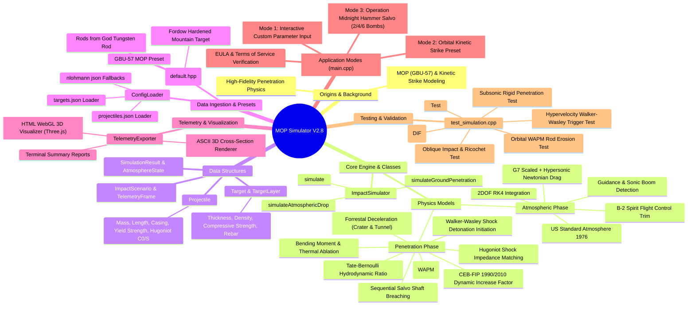

```
  _________________________________________________________________________________________
 /                                                                                         \
|  [!] END-USER LICENSE AGREEMENT (EULA) & TERMS OF SERVICE [!]                             |
|                                                                                           |
|  WARNING: This software is a high-fidelity, advanced physics and penetration simulator.   |
|  Usage of this application is strictly restricted to recreational, educational, and      |
|  hobbyist purposes. Due to the extreme accuracy and sensitive nature of the simulated     |
|  models, any unauthorized, commercial, or malicious application may result in severe      |
|  legal consequences.                                                                      |
|                                                                                           |
|  DISCLAIMER OF WARRANTY: This software is provided "AS IS", without warranty of any       |
|  kind, express or implied.                                                                |
|  LIMITATION OF LIABILITY: In no event shall the author(s) be liable for any claim,        |
|  damages, or other liability arising from, out of, or in connection with the software     |
|  or the use or other dealings in the software.                                            |
|  By using this repository, you acknowledge that this tool is not certified for real-world |
|  engineering, defense analysis, or physical destructive testing.                          |
 \_________________________________________________________________________________________/
```

# C++ Impact Physics & Terminal Ballistics Penetration Simulator v3.0

// Copyright (c) 2026 Omid Teimory. All Rights Reserved


A high-performance C++23 terminal ballistics simulation engine designed to model high-velocity kinetic impact, deep target penetration, Walker-Anderson hydrodynamic rod erosion (WAPM), Hugoniot shock initiation, and thermodynamic behavior of heavy penetrators (e.g., GBU-57 MOP, BLU-109, and Orbital Tungsten Rods) into multi-layered geological and reinforced concrete structures.

Includes an automated, zero-dependency **Interactive 100% Physics-Based WebGL 3D Visualization Pipeline** complete with Planck blackbody thermal radiation, US Standard Atmosphere 1976 barometric density models, supersonic Prandtl-Glauert Mach shock cones, precision school ruler measuring sub-divisions, and Web Audio USA National Anthem synthesis.

---

## 🔬 Core Physics & Mathematical Framework

The simulation engine integrates continuum mechanics, cavity expansion theory, Hugoniot shock impedance matching, and dynamic structural failure models step-by-step through depth.

### 1. Cavity Expansion & Deceleration Model (Two-Phase Forrestal / Poncelet)
For penetration into reinforced concrete and geological strata, the deceleration force $F_z$ is governed by cavity expansion dynamics:

$$ F_z = -\frac{\pi D^2}{4} \left( S f_c' + N \rho_t v^2 \right) $$

Where:
- $D$: Projectile diameter ($m$)
- $f_c'$: Dynamic Increase Factor (CEB-FIP DIF) adjusted compressive strength of target layer ($Pa$)
- $S$: Empirical target strength multiplier ($S = 82.6 \cdot (f_c')^{-0.544}$)
- $N$: Nose shape coefficient derived from Caliber Radius Head ($\text{CRH}$)
- $\rho_t$: Target material density ($kg/m^3$)
- $v$: Instantaneous velocity ($m/s$)

### 2. Walker-Anderson Hydrodynamic Rod Erosion (WAPM)
At hypervelocity speeds ($v > 1200\ m/s$), dynamic pressures exceed the casing yield strength ($P_{dyn} > Y_p$). The Tate-Bernoulli equation determines interface velocity $u$:

$$ Y_p + \frac{1}{2} \rho_p (v - u)^2 = R_t + \frac{1}{2} \rho_t u^2 $$

The eroding rod length $L(t)$ shrinks at rate $\frac{dL}{dt} = -(v - u)$, continuously updating projectile mass $m(t)$ and visual casing scale in WebGL.

### 3. Walker-Wasley Hugoniot Shock Initiation
Explosive shock initiation is evaluated by impedance matching shock Hugoniot jump conditions:

$$ U_s = C_0 + S U_p, \quad P = \rho_0 U_s U_p $$

Transmitted shock stress $P_{shock}$ and casing transit pulse duration $\tau$ evaluate critical initiation energy $P^2 \tau \ge E_c$.

### 4. Planck Blackbody Thermal Radiation Spectrum
Friction work $F_{\text{friction}} \cdot v$ and hydrodynamic erosion work $0.5 \rho_t (v-u)^3 A$ elevate casing temperature $T$. Thermal radiation in WebGL follows Planck's Law and Wien's Displacement Law ($\lambda_{\max} T = 2.89777 \times 10^{-3}\text{ m}\cdot\text{K}$), shifting emission from dull red ($800\text{ K}$) to bright orange ($1200\text{ K}$), incandescent white ($1800\text{ K}$), and radiant plasma ($2200\text{ K}+$) with Stefan-Boltzmann $T^4$ intensity scaling.

---

## 📁 Repository & Architecture Layout

```text
MOP Simulator/
├── assets/
│   └── visualizer_template.html   # 100% Physics WebGL 3D visualization engine + Web Audio
├── bin/
│   ├── sim.exe                    # Production CLI simulator binary (V3.0)
│   └── test_simulation.exe        # Automated physics unit testing binary
├── build/                         # Object files compiled during build
├── data/
│   ├── projectiles.json           # Presets for GBU-57 MOP, BLU-109, Tungsten Rods
│   └── targets.json               # Layered targets (Concrete, Soil, Granite)
├── documents/
│   ├── Ai/                        # AI coding directives, architecture & workflow
│   ├── commands/                  # Command references (compiling, testing, deploy)
│   ├── contribution/              # Contributor guidelines, Roadmap & JSON schema
│   ├── learning/                  # Post-mortems, console lifecycle & WebGL pipeline
│   └── physic/                    # Physics equations, WAPM, Hugoniot EOS & yield limits
├── include/
│   ├── config_loader.hpp          # JSON database parser interfaces
│   ├── default.hpp                # Hardcoded default presets (GBU-57, Granite)
│   ├── nlohmann/json.hpp          # Single-header JSON library
│   └── simulation.hpp             # Physics structures & simulator engine interface
├── src/
│   ├── config_loader.cpp          # Target/Projectile JSON loading implementation
│   ├── main.cpp                   # Application entry, EULA logic & CLI menus
│   └── simulation.cpp             # RK4 numerical integrator & 3D HTML exporter
├── tests/
│   └── test_simulation.cpp        # C++ unit test suite covering core physics regimes
├── CMakeLists.txt                 # CMake project configuration (V3.0.0)
├── Makefile                       # MinGW / GCC C++23 build pipeline
├── TODO.md                        # Project vision & completed milestones
└── README.md                      # Primary documentation
```

---

## 🛠️ Build & Compilation

### Requirements
- **Compiler**: GCC / MinGW-w64 with **C++23** support (`g++ >= 13.0`)
- **Build System**: `mingw32-make` or `make` or `CMake`

### 1. Compile Main Binary & Tests (`Makefile`)
Open PowerShell / Terminal in the project root:

```powershell
# Clean previous build artifacts
mingw32-make clean

# Build production executable (bin/sim.exe)
mingw32-make

# Build and run physics verification test suite (bin/test_simulation.exe)
mingw32-make test
```

---

## 🌐 Interactive 3D WebGL Physics Visualizer

The engine automatically exports `3d_visualizer.html` combining:
- **100% Physics WebGL Rendering**: Driven frame-by-frame by C++ telemetry.
- **US Standard Atmosphere 1976 Barometric Density**: Inverse transform sampled sky dust particles.
- **Prandtl-Glauert Supersonic Mach Shock Cones**: $\sin(\alpha) = 1/M$ attached in 3D matrix sync with bomb velocity vector.
- **Precision School Ruler Measuring Sub-Divisions**: 1m minor ticks, 5m medium ticks, and 10m major ticks + text labels for both underground depth and in-air altitude.
- **Web Audio USA National Anthem Synthesizer**: Heroic polyphonic Star-Spangled Banner playing during free-fall drop & penetration.

---

## 📜 License & Copyright

**Copyright (c) 2026 Omid Teimory. All Rights Reserved.**

Licensed under the GNU Affero General Public License v3.0 (AGPLv3). See `LICENSE` for details.
