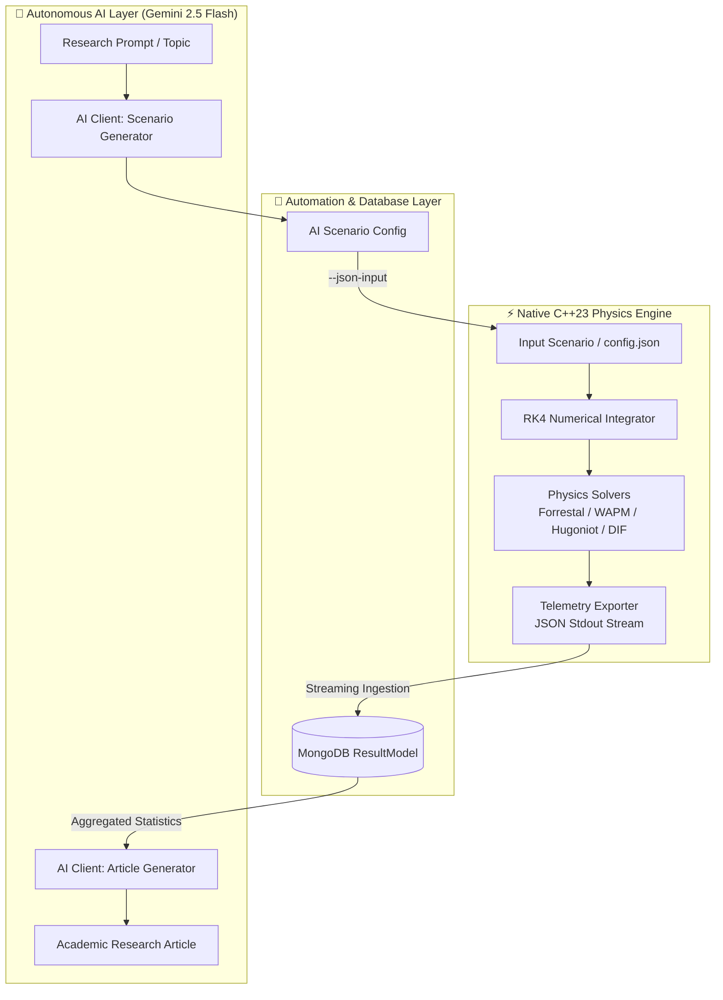

# 🧠 AI Integration & Closed-Loop Autonomous Simulation

> **Architecture & Roadmap Document**  
> *MOP Simulator — High-Fidelity Terminal Ballistics & Autonomous AI Platform*

---

## 📌 Executive Summary

The **AI Integration Module** establishes an intelligent, closed-loop autonomous research ecosystem bridging external AI/LLM models with the native C++23 physics engine. 

The system operates across two core AI roles:
1. **The Research Conductor** (`researchConductor`): Generates hypothesis-driven scenario parameters (projectile geometry, casing metallurgy, concrete strengths, angle of attack) and triggers automated C++ numerical runs.
2. **The Article Writer** (`articleWriter`): Ingests aggregate telemetry across hundreds or thousands of simulation cycles and synthesizes a full-length, publication-grade academic research paper (4,000–12,000 words).



---

## 🔄 The 2-Phase Autonomous Research Workflow

```
  [User: Research Topic]
          │
          ▼
  ┌─────────────────────────────────────────────────────────────┐
  │ PHASE 1: RESEARCH & SIMULATION LOOP (`POST /research`)      │
  │  1. AI Client synthesizes scenario config from topic        │
  │  2. Node.js writes temp JSON & spawns `mop_sim.exe`         │
  │  3. C++ executes RK4 & streams JSON frames                  │
  │  4. Node.js chunks & saves telemetry into MongoDB           │
  │  5. Repeats across N requested cycles                       │
  └─────────────────────────────────────────────────────────────┘
          │
          ▼
  ┌─────────────────────────────────────────────────────────────┐
  │ PHASE 2: SYNTHESIS & PUBLICATION (`POST /article`)          │
  │  1. Node.js aggregates telemetry for session/title          │
  │  2. Computes statistical distributions (mean, std-dev)      │
  │  3. AI Client generates 4,000+ word academic article        │
  │  4. Persists article into MongoDB `ArticleModel`            │
  └─────────────────────────────────────────────────────────────┘
```

---

## 🛠️ Prompt Architectures (`src/AI/Prompt.js`)

### 1. `researchConductor` (Scenario Generation)
Directs the AI to act as a senior ballistics engineer. Synthesizes strictly valid JSON matching the C++ input schema:
- **Projectile**: Mass, length, diameter, casing density, yield strength, Hugoniot $C_0/S$, explosive critical energy $E_c$.
- **Target**: Multi-layer strata (thickness, density, compressive strength, rebar fraction, Hugoniot properties).
- **Scenario**: Drop altitude, release velocity, flight path angle, obliquity angle, angle of attack.

### 2. `articleWriter` (Academic Article Synthesis)
Directs the AI to act as a research scientist. Synthesizes a formal research article adhering to standard scientific structures:
- **Title & Abstract**
- **1. Introduction** (Terminal ballistics theory, DBHT operational context)
- **2. Methodology & Simulation Physics** (Alekseevskii-Tate, Walker-Wasley, Hugoniot EOS, CEB-FIP DIF)
- **3. Results & Statistical Discussion** (Penetration depth distributions, regime breakdown, casing survivability)
- **4. Conclusion & Limitations**
- **References**

---

## 🔌 API Client Implementation (`src/AI/aiClient.js`)

The `AIClient` natively communicates with Google's **Gemini 2.5 Flash** model via REST:
- Uses `systemInstruction` with strict `application/json` output formatting.
- **Graceful Fallback**: If `GEMINI_API_KEY` is not present in `.env`, the client automatically falls back to deterministic, high-fidelity mock data ensuring zero runtime pipeline breakage.

---

## 🗺️ Implementation Roadmap

- [x] **Phase 1: Structured Telemetry Standard**
  - Line-delimited JSON telemetry output from C++ engine.
  - MongoDB schema matching simulation result payloads.
- [x] **Phase 2: Headless Node.js Bridge**
  - Direct `--json-input` config passing.
  - Asynchronous stream reading and chunked DB persistence.
- [x] **Phase 3: Autonomous Closed-Loop AI Platform**
  - Multi-cycle scenario generation and execution.
  - Automated statistical analysis and academic paper synthesis.
- [ ] **Phase 4: Embedded C++ Machine Learning (v4.0)**
  - Native LibTorch integration inside C++ kernel for $O(1)$ surrogate neural physics (see `src/MachineLearning/MachineLearning.md`).
