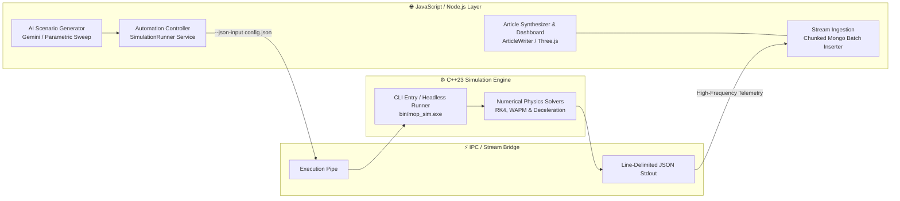

# ⚡ JavaScript + C++ Data Input & Output Automation Pipeline

> **Architecture & Engineering Guide**  
> *MOP Simulator — High-Speed Native Core with Automated Web/Node.js Orchestration*

---

## 📌 Executive Overview

This document outlines the **automation architecture bridging the high-performance C++23 native simulation engine with modern JavaScript/TypeScript ecosystems** (Node.js, Express, MongoDB, WebGL 3D Visualizer, and AI Orchestrators). 

By automating bidirectional data flow, the system eliminates manual scenario setup, executes massive headless parametric sweeps, streams telemetry directly into MongoDB in memory-safe chunks, and synthesizes comprehensive research articles.



---

## 🔁 Automated Pipeline Architecture

```
  [Node.js Express Controller / AI Client]
         │
         ▼  (1) Generates & injects scenario JSON payloads via temp config file
  [C++ Simulation Engine (bin/mop_sim.exe --json-input)]
         │
         ▼  (2) Executes sub-millisecond numerical integration & prints line-delimited JSON
  [Telemetry Stream (Line-by-Line Stdout Interface)]
         │
         ▼  (3) Automates ingestion, session tagging & chunked MongoDB persistence
  [MongoDB Database ➔ AI Article Synthesizer / WebGL 3D Visualizer]
```

### 1. Automated Input Generation (`JS ➔ C++`)
* **AI Hypothesis Generation**: The AI Client (using Gemini API or deterministic mocks) synthesizes complex physical parameter sets (projectile dimensions, casing alloys, target layers, atmospheric conditions).
* **Temp File Serialization**: Node.js serializes the JSON configuration to a temporary file (`os.tmpdir()`) and invokes `mop_sim.exe --json-input <path>`.
* **Headless Execution**: Completely bypasses interactive console menus (`std::cin`), enabling seamless unattended execution.

### 2. Execution & Lifecycle Management
* **Watchdog Timers**: 30-second execution timeouts prevent process lockups in case of numerical instability or infinite loops.
* **Session Scoping**: Automatically tags every frame with `session_id` and `research_title` to prevent cross-experiment data pollution.

### 3. Automated Output Ingestion (`C++ ➔ JS`)
* **Asynchronous Line Streaming**: Utilizes Node.js `readline` with asynchronous `for await` loops to maintain stream backpressure.
* **Chunked Batch Insertion**: Buffers frames into 1,000-frame batches before committing to MongoDB with `insertMany()`, preventing Out-Of-Memory (OOM) crashes and BSON document size limits.

### 4. Automated Export & Interactive Visualization
* **Dynamic WebGL Generation**: Automatically compiles simulation outputs into standalone interactive 3D HTML reports (via Three.js).
* **Academic Article Synthesis**: Statistical aggregation of simulation batches generates structured 4,000+ word academic research articles.

---

## 🔌 Inter-Process Communication (IPC) Protocol

### 1. Headless CLI Command Interface
```bash
# Automated Single Run with JSON Config
./bin/mop_sim.exe --json-input "path/to/config.json"

# Automated Research REST API Invocation
curl -X POST http://localhost:3000/research \
  -H "Content-Type: application/json" \
  -d '{"title": "Optimizing Casing Thickness for 70MPa Concrete", "count": 5}'
```

### 2. Streaming Node.js Integration (`SimulationRunner`)

```javascript
const { spawn } = require('child_process');
const readline = require('readline');
const fs = require('fs/promises');
const ResultModel = require('../model/result/result');

async function runSimulation(config, metadata) {
    const tmpConfigPath = `/tmp/mop_config_${Date.now()}.json`;
    await fs.writeFile(tmpConfigPath, JSON.stringify(config));

    const simProcess = spawn('./bin/mop_sim.exe', ['--json-input', tmpConfigPath]);
    const rl = readline.createInterface({ input: simProcess.stdout, crlfDelay: Infinity });

    let chunk = [];
    for await (const line of rl) {
        if (line.trim().startsWith('{') && line.trim().endsWith('}')) {
            const frame = JSON.parse(line);
            frame.research_title = metadata.research_title;
            frame.session_id = metadata.session_id;
            chunk.push(frame);

            if (chunk.length >= 1000) {
                await ResultModel.insertMany(chunk);
                chunk = [];
            }
        }
    }
    if (chunk.length > 0) await ResultModel.insertMany(chunk);
}
```

---

## 📊 Key Automation Features & Benefits

| Automation Feature | Implementation Mechanism | Benefit |
| :--- | :--- | :--- |
| **Direct JSON Config** | `--json-input` flag with `nlohmann::json` parser | Immune to CLI prompt changes and ordering errors. |
| **Memory-Safe Streaming** | Asynchronous `readline` iteration + 1,000-frame chunking | Zero OOM crashes, capable of handling 100,000+ frames per run. |
| **Session Isolation** | Multi-tenant session tags (`session_id`, `research_title`) | Zero cross-contamination during multi-topic research. |
| **Hang Protection** | 30s process timeout watchdog | Prevents CPU lockup from numerical divergence. |
| **Academic Synthesis** | Statistical aggregation + Gemini Flash 2.5 | Transforms raw telemetry into publication-ready research papers. |

---

## 🗺️ Engineering Milestones

- [x] **Milestone 1: Headless CLI & Direct JSON Pipe in C++**
  - Added `--json-input` argument to `src/simulation/penetration/main.cpp`.
  - Direct JSON line-delimited stdout streaming with buffer flushing.
- [x] **Milestone 2: Node.js Automation Runner & Chunked DB Streamer**
  - Implemented `SimulationRunner` with chunked MongoDB ingestion.
  - Implemented `Research` service with multi-cycle autonomous loops and session tagging.
- [x] **Milestone 3: Automated Article Generation Pipeline**
  - Statistical analysis aggregator (`articleWriter.js`).
  - LLM integration with Gemini API and deterministic fallback.
- [ ] **Milestone 4: C++ Machine Learning Kernel (v4.0)**
  - LibTorch surrogate physics modeling for $O(1)$ batch simulation.
