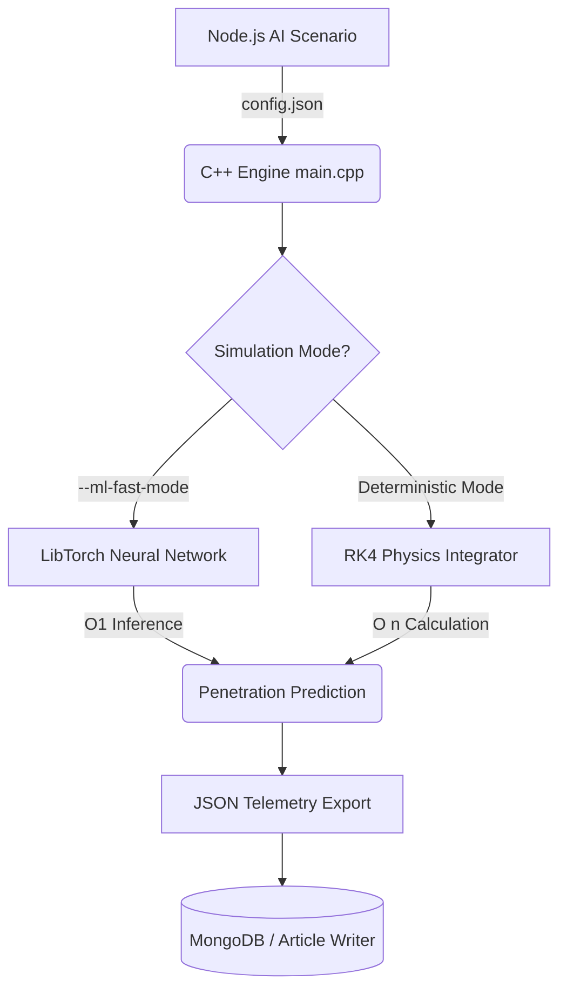

# C++ Machine Learning Vision: MOP Simulator V4.0

## 1. The Vision
Currently, the MOP Simulator is a deterministic, physics-based numerical integrator (using Runge-Kutta 4th Order). While highly accurate, mathematical models like Alekseevskii-Tate and Forrestal are computationally expensive and bound by rigid equations. 

The vision for **V4.0** is to embed high-performance Machine Learning (ML) directly into the C++ kernel. By augmenting hard physics with neural networks, we can evolve the simulator from a rigid mathematical "calculator" into an "intelligent, predictive sandbox."

---

## 2. Core Use Cases for C++ ML

### A. Surrogate Physics Modeling (Neural Physics)
- **Concept:** Replace the heaviest CPU calculations (like 3D hydrodynamic erosion, dynamic pressure gradients, and complex target spallation) with a Deep Neural Network (DNN). 
- **Benefit:** Once trained on 100,000 deterministic RK4 runs, the C++ Neural Network can predict the penetration depth and crater geometry in $O(1)$ time. This allows the Node.js backend to run millions of simulation cycles in seconds rather than hours.

### B. Reinforcement Learning (RL) Smart Fuzing
- **Concept:** Currently, the bomb detonates upon reaching zero velocity or a hard-coded depth. We will embed an RL agent inside the C++ engine to act as the bomb's internal microcontroller.
- **Benefit:** The agent reads real-time accelerometer data (`g-force` and `shock pressure`) frame-by-frame and decides *exactly* which microsecond to trigger the explosion to maximize structural catastrophic failure. It can learn to ignore dummy bunker floors and void spaces.

### C. Aero-Guidance Optimization
- **Concept:** Implement an ML controller to adjust the projectile's flight path angle (`trim_deg`) and angle of attack during the atmospheric drop phase.
- **Benefit:** The AI will learn how to ride the atmospheric density gradients and Mach drag-curves to hit the target with maximum kinetic energy and optimal obliquity.

---

## 3. Technology Stack & C++ Libraries
Since this must remain a highly optimized C++ environment, running Python scripts dynamically is too slow for the physics kernel. We will use native C++ ML libraries:

1. **LibTorch (PyTorch C++ API)** 
   - *Why:* Industry standard, GPU-accelerated (CUDA). We can train the massive models in Python using our MongoDB telemetry data, export them as `.pt` (TorchScript) files, and run inference directly in C++ at lightning speed.
2. **mlpack** 
   - *Why:* A lightweight, extremely fast C++ machine learning library. Perfect for smaller regression models (like interpolating missing material properties for custom target alloys without needing a massive GPU).
3. **nlohmann/json** 
   - *Why:* Already integrated! We will use this to stream the tensor shapes, hyperparameters, and ML config between the Node.js automation layer and the C++ engine.

---

## 4. Implementation Roadmap

### Phase 1: Data Harvesting (Current State)
- **Action:** Utilize the newly fortified `POST /research` pipeline to flood the MongoDB database with millions of rows of deterministic telemetry data (Inputs: velocity, mass, density -> Outputs: penetration depth, shock damage).
- **Goal:** Build the massive, perfectly clean training dataset required to train the physics models.

### Phase 2: Python Training & TorchScript Export
- **Action:** Write Python scripts (outside of C++) that query MongoDB, train a Deep Neural Network to learn the physics engine (e.g., predicting `actual_penetration_depth` based on target density and impact velocity).
- **Goal:** Export the trained neural network as a C++ readable `model.pt` file.

### Phase 3: C++ Inference Integration (LibTorch)
- **Action:** Add `<torch/script.h>` to the C++ project. Load `model.pt` during simulator initialization.
- **Goal:** Add a `--ml-fast-mode` CLI flag. When enabled, the C++ code completely skips the `while(velocity > 0)` RK4 loop and asks the Neural Network for the final crater dimensions, spitting out the JSON telemetry instantly.

### Phase 4: Reinforcement Learning (Active Simulation)
- **Action:** Embed a lightweight RL policy inside `simulation.cpp`. 
- **Goal:** At every `dt = 0.001` step of the simulation, the C++ code passes `[velocity, depth, pressure]` to the neural network. The network returns `1` (detonate now) or `0` (keep penetrating).

---

## 5. Architectural Flow Diagram

