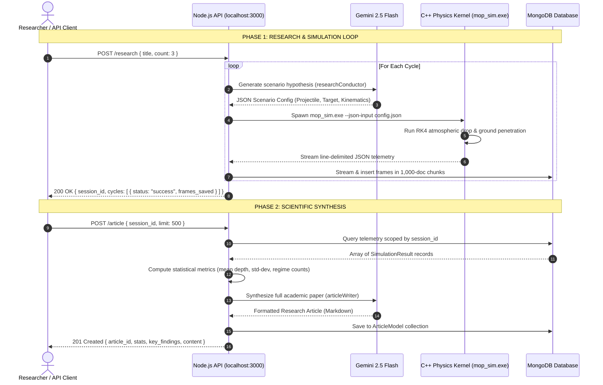

# 1. MOP Simulator — Project Overview

// Copyright (c) 2026 Omid Teimory. All Rights Reserved.

---

## 📌 Introduction

**MOP Simulator V3.5.0** is an open-source, full-stack computational research platform designed to model and analyze high-velocity terminal ballistics against deeply buried, hardened target structures (DBHTs). 

The platform bridges a high-performance **C++23 continuum mechanics engine** with an automated **Node.js/Express orchestration backend** and advanced **Google Gemini 2.5 Flash AI integration**.

```
  _________________________________________________________________________________________
 /                                                                                         \
|  [!] END-USER LICENSE AGREEMENT (EULA) & TERMS OF SERVICE [!]                             |
|                                                                                           |
|  WARNING: This software is a high-fidelity, advanced physics and penetration simulator.   |
|  Usage of this application is strictly restricted to recreational, educational, and       |
|  hobbyist purposes. Due to the extreme accuracy and sensitive nature of the simulated     |
|  models, any unauthorized, commercial, or malicious application may result in severe      |
|  legal consequences.                                                                      |
|                                                                                           |
|  DISCLAIMER OF WARRANTY: This software is provided "AS IS", without warranty of any       |
|  kind, express or implied.                                                                |
|  LIMITATION OF LIABILITY: In no event shall the author(s) be liable for any claim,        |
|  damages, or other liability arising from, out of, or in connection with the software     |
|  or the use or other dealings in the software.                                            |
|  By using this repository, you acknowledge that this tool is not certified for real-world |
|  engineering, defense analysis, or physical destructive testing.                          |
 \_________________________________________________________________________________________/
```

---

## 🎯 Platform Capabilities

1. **Multi-Phase Terminal Ballistics**:
   - **Phase 1: Atmospheric Free-Fall Drop**: 4th-Order Runge-Kutta (RK4) numerical integration with US Standard Atmosphere (1976) and Mach-dependent Caliber-Radius-Head (CRH) aerodynamic drag.
   - **Phase 2: Subterranean Penetration**: Two-Phase Forrestal cavity expansion (cratering + deep tunneling), CEB-FIP Dynamic Increase Factor (DIF), and Alekseevskii-Tate Walker-Anderson Hydrodynamic Rod Erosion (WAPM).
   - **Explosive & Casing Survivability**: Walker-Wasley shock initiation ($P^2\tau \ge E_c$), Hugoniot equation of state jump conditions, and casing thermodynamic melting/ablation.

2. **Autonomous AI Closed-Loop Research**:
   - **Research Conductor (`researchConductor`)**: Synthesizes hypothesis-driven scenario configurations (projectile geometry, casing alloys, target strata).
   - **Simulation Runner**: Executes headless C++ runs (`--json-input`), streaming line-delimited JSON telemetry to MongoDB in 1,000-frame chunks.
   - **Article Writer (`articleWriter`)**: Performs statistical analysis across simulation batches (mean depth, standard deviation, regime distribution) and synthesizes publication-grade research papers.

3. **Interactive 3D Visualizers**:
   - Standalone **Three.js WebGL visualizer** (`3d_visualizer.html`) with Planck blackbody radiation and Prandtl-Glauert supersonic shock cones.
   - Full **Unreal Engine 5 module** (`UnreaEngine`) with blueprint integration and async simulation threads.

---

## 🔄 The 2-Phase Research Cycle



---

## 🧭 Navigation

* To set up and run the system, proceed to [1.1 Getting Started](01-01-getting-started.md).
* To view future milestones and contribution guidelines, see [1.2 Project Roadmap & Contribution Guide](01-02-roadmap-and-contribution.md).
* For detailed technical architecture, see [2. System Architecture](02-system-architecture.md).
