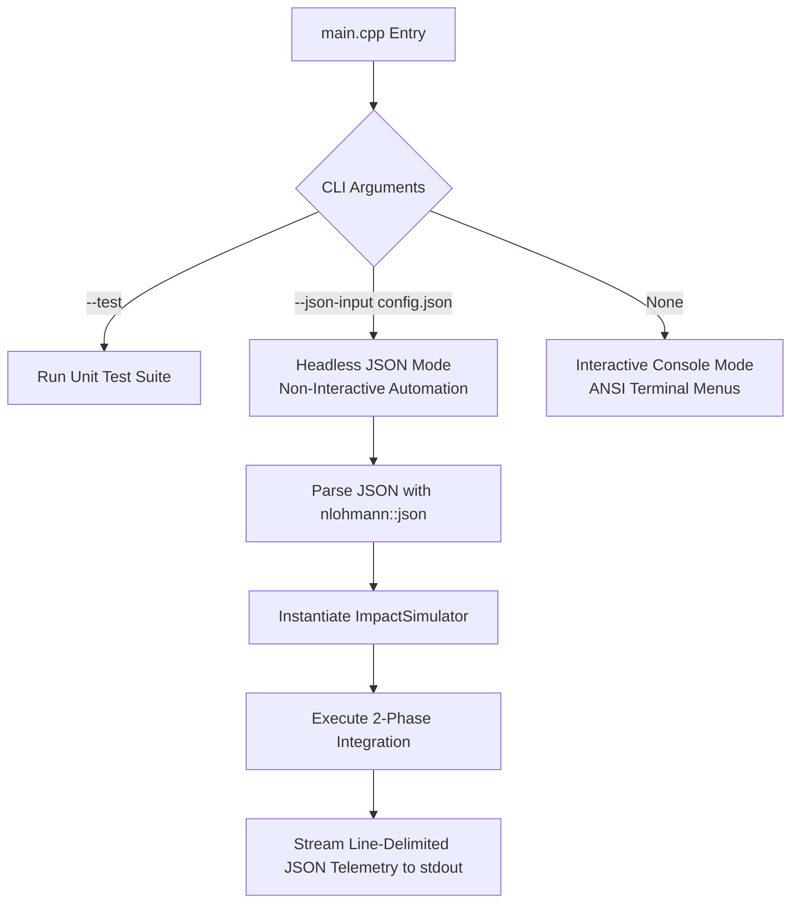

# 2.1 C++ Physics Engine (`src/simulation`)

// Copyright (c) 2026 Omid Teimory. All Rights Reserved.

---

## ⚙️ Overview & Architecture

The **C++ Physics Kernel** is the computational core of the MOP Simulator. Compiled with modern **C++23** optimizations, it provides deterministic, sub-millisecond numerical calculations for terminal ballistics, continuum cavity expansion, hydrodynamic erosion, and shock physics.

### Source File Map

| Source File | Header File | Responsibility |
| :--- | :--- | :--- |
| `src/simulation/penetration/main.cpp` | — | CLI entry point, argument parser (`--json-input`, `--test`), interactive console menus. |
| `src/simulation/penetration/simulation.cpp` | `include/penetration/simulation.hpp` | Numerical solvers, 2-phase RK4 integrator, Forrestal cavity expansion, WAPM erosion, Walker-Wasley initiation. |
| `src/simulation/penetration/telemetry_exporter.cpp` | `include/penetration/telemetry_exporter.hpp` | Line-delimited JSON stdout emitter, terminal ASCII visualization, standalone 3D HTML generator. |
| `src/simulation/penetration/config_loader.cpp` | `include/penetration/config_loader.hpp` | JSON database ingestion (`data/projectiles.json`, `data/targets.json`) via `nlohmann::json`. |
| `src/simulation/penetration/environment_physics.cpp` | `include/penetration/environment_physics.hpp` | US Standard Atmosphere (1976) thermodynamic properties and speed of sound solvers. |
| — | `include/penetration/default.hpp` | Hardcoded default physical constants and archetype presets (`MOP_DEFAULT`, `CONCRETE_DEFAULT`, etc.). |

---

## 🚪 Execution Entry Modes



### 1. Headless JSON Mode (`--json-input`)

Designed specifically for automated AI sweeps, Node.js child processes, and batch testing:
- Reads configuration from an external JSON file.
- Bypasses all interactive `std::cin` prompts and EULA agreements.
- Emits line-delimited JSON telemetry directly to `std::cout`.
- Exits cleanly with code `0` on completion.

```bash
./bin/mop_sim.exe --json-input "/path/to/scenario_config.json"
```

### 2. Interactive Console Mode

Designed for manual exploration in a terminal:
- Displays ASCII banner and requires interactive EULA agreement.
- Offers interactive menus to select predefined munitions (GBU-57, BLU-109, Rods from God) or configure custom target layer strata.
- Outputs rich terminal ASCII telemetry diagrams and generates `3d_visualizer.html`.

### 3. Unit Test Mode (`--test`)

Executes five comprehensive physical regression tests validating subsonic penetration, hypervelocity shock initiation, WAPM rod erosion, DIF dynamic scaling, and oblique structural snapping.

```bash
./bin/mop_sim.exe --test
```

---

## 🔄 `ImpactSimulator` Execution Lifecycle

```cpp
// 1. Instantiation (Stateless, immutable dependencies)
ImpactSimulator simulator(munition, targetObject, physicsConstants);

// 2. Execution (Per-scenario numerical integration)
SimulationResult result = simulator.simulate(scenarioConfig);

// 3. Telemetry Output (Immediate buffer flushing)
TelemetryExporter::streamJsonFrames(result);
```

### Execution Steps inside `simulate(scenario)`:

1. **Pre-Drop Initialization**: Evaluates aircraft drop conditions, calculates geometric cross-sectional area, derives initial Mach number and atmospheric state at drop altitude.
2. **Phase 1: Atmospheric Free-Fall Integration**: Runs RK4 integration ($\Delta t = 0.01\text{ s}$) from drop altitude down to ground surface ($y = 0$). Computes altitude-dependent air density, aerodynamic drag force, Mach number, and flags supersonic sonic boom transitions.
3. **Transition & Surface Shock Evaluation**: Evaluates target surface impact velocity ($v_{imp}$), obliquity angle, dynamic pressure ($P_{dyn}$), Hugoniot shock velocity ($U_s$), particle velocity ($U_p$), transmitted shock pressure ($P_{trans}$), and Walker-Wasley critical energy ($P^2\tau \ge E_c$).
4. **Phase 2: Subterranean Penetration Integration**:
   - **Cratering Phase ($z < 2D$)**: Unconfined spallation resistance proportional to entry depth.
   - **Deep Tunneling Phase ($z \ge 2D$)**: Spherical cavity expansion (Forrestal equations) scaled by CEB-FIP DIF strain-rate target strengthening.
   - **Hydrodynamic Rod Erosion**: Alekseevskii-Tate mass loss when dynamic pressure exceeds casing yield strength.
   - **Frictional Thermodynamics**: Temperature accumulation, heat dissipation, and mass ablation at casing melting point.
   - **Structural Bending Checks**: Evaluates asymmetric forces during oblique entry to detect J-Hook bending failure.
5. **Finalization & State Assembly**: Compiles final penetration depth, remaining rod length, surviving explosive mass, peak $g$-forces, and telemetry frame vectors into `SimulationResult`.

---

## 🧭 Subsections

* [2.1.1 Physics Models & Numerical Methods](02-01-01-physics-models-and-numerical-methods.md)
* [2.1.2 Data Structures & Configuration Schema](02-01-02-data-structures-and-config-schema.md)
