# 2.2.2 Services: SimulationRunner & ArticleWriter

// Copyright (c) 2026 Omid Teimory. All Rights Reserved.

---

## ⚙️ Service Architecture

The business logic of the Node.js automation layer is encapsulated in three primary service modules:
1. `service/simulationRunner.js` (IPC Process Manager & Chunked Stream Ingestion)
2. `service/articleWriter.js` (Statistical Analysis & Publication Pipeline)
3. `service/research.js` (Multi-Cycle Autonomous Loop Orchestrator)

---

## 1. `SimulationRunner` (`service/simulationRunner.js`)

`SimulationRunner` is responsible for spawning native C++ binary instances, maintaining watchdog protection, parsing line-delimited JSON telemetry streams, and batch-inserting frames into MongoDB.

```mermaid
sequenceDiagram
    autonumber
    participant SR as SimulationRunner
    participant FS as File System (Temp Dir)
    participant CP as Child Process (mop_sim.exe)
    participant RL as Readline Async Stream
    participant DB as MongoDB (ResultModel)

    SR->>FS: Write temporary JSON config file
    SR->>CP: spawn(bin/mop_sim.exe, [--json-input, tmp_path])
    SR->>SR: Start 30s Watchdog Timer
    loop Line-by-Line Stdout Iteration
        CP->>RL: Emit JSON Telemetry Line
        RL->>SR: Parse frame & tag with session_id
        SR->>SR: Buffer frame into chunk array
        alt Chunk size >= 1,000
            SR->>DB: insertMany(chunk)
            SR->>SR: Clear chunk array
        end
    end
    CP-->>SR: Process Exited (code 0)
    SR->>DB: insertMany(remaining_chunk)
    SR->>FS: Delete temporary JSON config file
    SR->>SR: Clear Watchdog Timer
```



### Implementation Highlights:

* **Watchdog Protection**:
  ```javascript
  const watchdog = setTimeout(() => {
      simProcess.kill('SIGKILL');
      reject(new Error('Simulation timed out after 30 seconds.'));
  }, 30000);
  ```
* **Asynchronous Chunked Ingestion**:
  ```javascript
  let chunk = [];
  for await (const line of rl) {
      if (line.trim().startsWith('{') && line.trim().endsWith('}')) {
          const frame = JSON.parse(line);
          frame.session_id = metadata.session_id;
          frame.research_title = metadata.research_title;
          chunk.push(frame);

          if (chunk.length >= 1000) {
              await ResultModel.insertMany(chunk);
              chunk = [];
          }
      }
  }
  if (chunk.length > 0) await ResultModel.insertMany(chunk);
  ```

---

## 2. `ArticleWriter` (`service/articleWriter.js`)

`ArticleWriter` aggregates simulation telemetry stored under a given `session_id`, runs rigorous statistical analysis, constructs structured prompts, and invokes the AI client to generate an academic research paper.

### Statistical Metrics Evaluated:

1. **Penetration Depth Metrics**:
   $$\text{Mean: } \bar{z} = \frac{1}{N} \sum_{i=1}^N z_i$$
   $$\text{Sample Standard Deviation: } \sigma = \sqrt{\frac{1}{N-1} \sum_{i=1}^N (z_i - \bar{z})^2}$$
   $$\text{Extremes: } z_{min} = \min(z_i), \quad z_{max} = \max(z_i)$$

2. **Kinematic & Shock Metrics**:
   * Average terminal impact velocity ($\bar{v}$ in $m/s$) and Mach number ($\bar{M}$).
   * Average impact kinetic energy ($\bar{E}_k$ in $GJ$).
   * Average peak interface shock pressure ($\bar{P}_{shock}$ in $GPa$).

3. **Regime & Integrity Distribution**:
   * Casing Failure Rate: Percentage of scenarios where structural yield, snapping, or thermal melting occurred.
   * Hydrodynamic Erosion Rate: Percentage of scenarios triggering WAPM mass loss.
   * Dominant Regime Identification: Highest-frequency terminal outcome across the batch.

---

## 3. `ResearchService` (`service/research.js`)

Coordinates multi-cycle research execution loops:
1. Generates a unique 8-character cryptographic hexadecimal `session_id` using `crypto.randomBytes(4).toString('hex')`.
2. Creates an active `ResearchSessionModel` entry in MongoDB.
3. Loops $N$ times (where $N = \text{count}$):
   - Prompts `aiClient.generateScenario()` for topic variations.
   - Invokes `simulationRunner.runSimulation()`.
   - Records per-cycle telemetry count and execution status.
4. Marks the research session as `completed` and returns summary results to the controller.

---

## 🧭 Navigation

* [Back to 2.2 Node.js Automation Layer](02-02-nodejs-automation-layer.md)
* [Proceed to 2.2.3 MongoDB Data Models](02-02-03-mongodb-data-models.md)
* [Explore 2.3 AI Orchestrator Layer](02-03-ai-orchestrator-layer.md)
