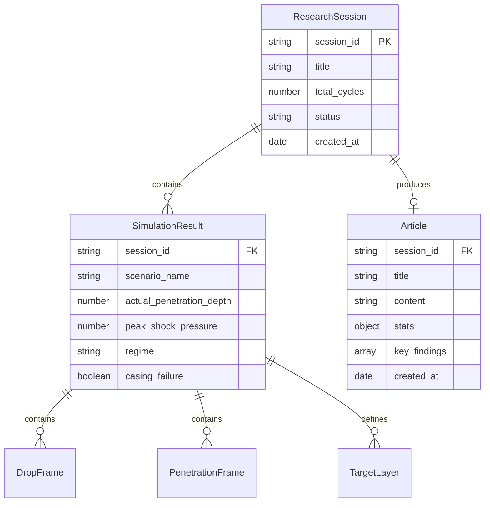

# 2.2.3 MongoDB Data Models

// Copyright (c) 2026 Omid Teimory. All Rights Reserved.

---

## 🗄️ Database Architecture & Schemas

The Node.js automation layer utilizes **Mongoose** to persist telemetry, simulation summaries, research sessions, and generated academic articles in MongoDB.



---

## 1. `ResultModel` (`src/Automation/model/result.js`)

Stores complete simulation results, trajectory telemetry, shock wave metrics, and high-frequency frame sequences.

```javascript
const mongoose = require('mongoose');

const ResultSchema = new mongoose.Schema({
    session_id: { type: String, required: true, index: true },
    research_title: { type: String, default: 'Standalone Simulation' },
    scenario_name: { type: String, required: true },
    altitude_ft: Number,
    velocity: Number,
    mach_number: Number,
    kinetic_energy: Number,
    dynamic_pressure: Number,
    actual_penetration_depth: Number,
    rigid_penetration: Number,
    hydro_penetration: Number,
    cumulative_breach_depth: Number,
    casing_failure: Boolean,
    premature_detonation: Boolean,
    explosive_charge_survives: Boolean,
    is_kinetic_rod: Boolean,
    regime: String,
    outcome_summary: String,
    erosion_occurred: Boolean,
    final_rod_length: Number,
    erosion_length_lost: Number,
    dynamic_increase_factor: Number,
    bar_wave_speed: Number,
    shock_pressure_gpa_peak: Number,
    shock_pulse_duration_us: Number,
    shock_damage_prob_percent: Number,
    drop_frames: [require('./dropFrame').schema],
    penetration_frames: [require('./penetrationFrame').schema],
    target_layers: [require('./targetLayer').schema],
    created_at: { type: Date, default: Date.now, index: true }
});

// Compound index for high-speed multi-tenant telemetry retrieval
ResultSchema.index({ session_id: 1, created_at: -1 });

module.exports = mongoose.model('SimulationResult', ResultSchema);
```

---

## 2. `ArticleModel` (`src/Automation/model/article.js`)

Persists synthesized academic research articles and computed statistical metadata.

```javascript
const mongoose = require('mongoose');

const ArticleSchema = new mongoose.Schema({
    session_id: { type: String, required: true, index: true },
    title: { type: String, required: true },
    word_count: Number,
    scenarios_analyzed: Number,
    stats: {
        totalScenarios: Number,
        avgPenetrationDepth: String,
        maxPenetrationDepth: String,
        minPenetrationDepth: String,
        stdDevPenetration: String,
        avgVelocity: String,
        avgMach: String,
        avgEnergyGJ: String,
        avgShockPressureGPa: String,
        casingFailureRate: String,
        erosionRate: String,
        dominantRegime: String,
        regimeDistribution: mongoose.Schema.Types.Mixed
    },
    key_findings: [String],
    content: { type: String, required: true }, // Full Markdown paper
    created_at: { type: Date, default: Date.now }
});

module.exports = mongoose.model('Article', ArticleSchema);
```

---

## 3. `ResearchSessionModel` (`src/Automation/model/researchSession.js`)

Tracks the lifecycle of multi-cycle autonomous research campaigns.

```javascript
const mongoose = require('mongoose');

const ResearchSessionSchema = new mongoose.Schema({
    session_id: { type: String, required: true, unique: true, index: true },
    title: { type: String, required: true },
    description: String,
    total_cycles: { type: Number, required: true },
    completed_cycles: { type: Number, default: 0 },
    status: { type: String, enum: ['pending', 'running', 'completed', 'failed'], default: 'pending' },
    cycles: [{
        cycle_number: Number,
        frames_saved: Number,
        status: String,
        error_message: String,
        timestamp: { type: Date, default: Date.now }
    }],
    created_at: { type: Date, default: Date.now }
});

module.exports = mongoose.model('ResearchSession', ResearchSessionSchema);
```

---

## 🧭 Navigation

* [Back to 2.2 Node.js Automation Layer](02-02-nodejs-automation-layer.md)
* [Proceed to 2.3 AI Orchestrator Layer](02-03-ai-orchestrator-layer.md)
* [Explore 2.1.2 Data Structures & Configuration Schema](02-01-02-data-structures-and-config-schema.md)
