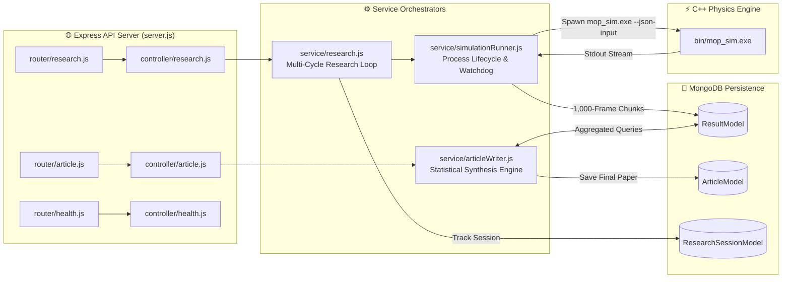

# 2.2 Node.js Automation Layer (`src/Automation`)

// Copyright (c) 2026 Omid Teimory. All Rights Reserved.

---

## 🌐 Overview & Architecture

The **Node.js Automation Layer** is an enterprise-grade orchestration backend built with Express.js and MongoDB. It bridges high-level AI reasoning agents with the native C++23 simulation engine, automating parameter injection, stream ingestion, data persistence, and scientific article synthesis.

---

## 🔑 Core Responsibilities

1. **Autonomous Process Management**:
   - Spawns native `bin/mop_sim.exe` child processes via Node.js `child_process.spawn`.
   - Serializes incoming scenario payloads into temporary JSON files (`os.tmpdir()`) to pass cleanly into `--json-input`.
   - Maintains a **30-second watchdog timer** that kills hung child processes (`SIGKILL`) if numerical instability arises.

2. **Memory-Safe Asynchronous Stream Ingestion**:
   - Reads line-delimited JSON telemetry from `stdout` using asynchronous `readline` generators (`for await (const line of rl)`).
   - Enforces stream backpressure and buffers telemetry into **1,000-document batches** before calling `insertMany()`.
   - Bounds memory usage to $< 50\text{ MB}$ even during simulations emitting $> 100,000$ frames.

3. **Multi-Tenant Session Scoping**:
   - Automatically generates a cryptographic hexadecimal `session_id` for every research campaign.
   - Stamps every telemetry document, simulation result, and synthesized article with `session_id` and `research_title`, guaranteeing zero cross-contamination.

4. **Statistical Aggregation & Synthesis**:
   - Calculates mathematical distributions across simulation batches (mean penetration depth, standard deviation, peak shock pressures, regime frequencies).
   - Passes clean statistical payloads to the AI Article Writer for formal scientific publication synthesis.

---

## 🧭 Subsections

* [2.2.1 REST API Endpoints & Controllers](02-02-01-rest-api-endpoints-and-controllers.md)
* [2.2.2 Services: SimulationRunner & ArticleWriter](02-02-02-services-simulation-runner-and-article-writer.md)
* [2.2.3 MongoDB Data Models](02-02-03-mongodb-data-models.md)
