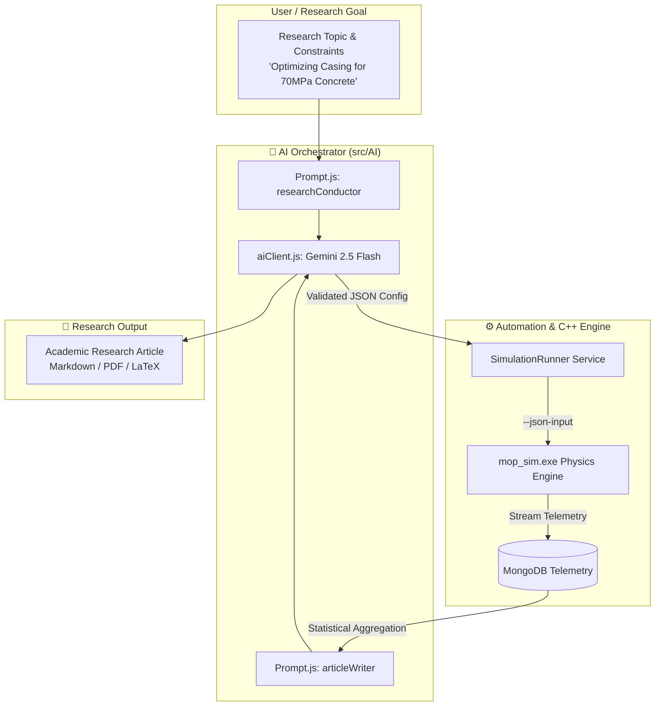

# 2.3 AI Orchestrator Layer (`src/AI`)

// Copyright (c) 2026 Omid Teimory. All Rights Reserved.

---

## 🧠 Overview & Cognitive Architecture

The **AI Orchestrator Layer** (`src/AI`) establishes an autonomous, closed-loop research ecosystem by coupling advanced Large Language Models (**Google Gemini 2.5 Flash**) with the deterministic C++23 continuum mechanics engine.

---

## 🔌 API Client Implementation (`src/AI/aiClient.js`)

The `AIClient` natively communicates with Google's **Gemini 2.5 Flash** model via REST API.

### Key Capabilities:

1. **Strict JSON Schema Enforcement**:
   Requests are made using `systemInstruction` directives and `responseMimeType: 'application/json'`, ensuring that generated scenario configurations parse cleanly directly into the C++ `config_loader.cpp` schema without regex extraction errors.

2. **Graceful Deterministic Fallback**:
   If `GEMINI_API_KEY` is not present in `.env` or if an external network outage occurs, the client automatically engages high-fidelity deterministic mock algorithms. This guarantees that automated unit tests, CI/CD pipelines, and local development environments execute without external API dependencies.

---

## 📝 Prompt Engineering Templates (`src/AI/Prompt.js`)

The system defines two primary persona-based prompt templates:

### 1. `researchConductor` (Scenario Hypothesis Formulation)
Directs the AI to act as a **Senior Terminal Ballistics Engineer**:
* Ingests high-level research topics (e.g., *"Ultra-High Performance Concrete Penetration with Alloy Casing"*).
* Synthesizes physically valid projectile and target parameters:
  - Projectile mass, body length, diameter, and nose Caliber-Radius-Head (CRH).
  - Casing flow stress $Y_p$, Hugoniot equation of state parameters ($C_0, S$), and critical initiation energy $E_c$.
  - Target strata thicknesses, compressive strengths ($f_c'$), rebar fractions, and densities.
  - Delivery kinematics (drop altitude, release velocity, obliquity angle).

### 2. `articleWriter` (Academic Publication Synthesis)
Directs the AI to act as a **Computational Materials Scientist & Defense Researcher**:
* Ingests aggregated statistical metrics across completed simulation cycles (mean breach depth, sample standard deviation $\sigma$, peak interface shock pressures, regime frequencies).
* Synthesizes a formal 4,000–12,000 word academic paper adhering to IEEE/AIAA journal structures:
  1. **Title & Abstract**: Quantitative overview of findings.
  2. **1. Introduction**: Tactical DBHT operational context and ballistic mechanics.
  3. **2. Mathematical & Physical Formulations**: Cavity expansion theory, CEB-FIP DIF, WAPM rod erosion, and Walker-Wasley shock initiation.
  4. **3. Experimental Results & Statistical Discussion**: Distribution analysis, depth vs velocity regressions, and casing survivability envelopes.
  5. **4. Conclusion & Limitations**: Key structural takeaways.
  6. **References & Citations**: Formal bibliography.

---

## 🧭 Navigation

* [Back to 2. System Architecture](02-system-architecture.md)
* [Proceed to 3. 3D WebGL Visualizer](03-3d-webgl-visualizer.md)
* [Explore 2.2 Node.js Automation Layer](02-02-nodejs-automation-layer.md)
