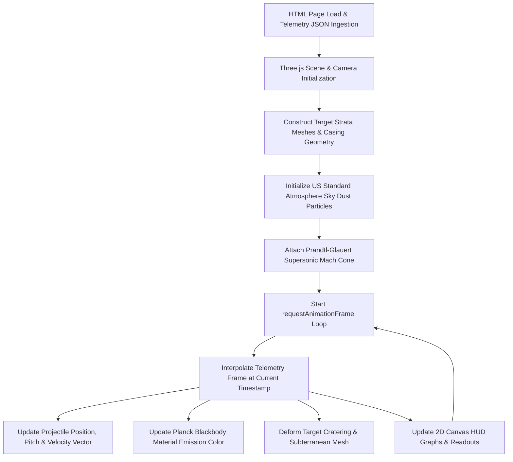

# 3.1 Visualizer Architecture & Rendering Pipeline

// Copyright (c) 2026 Omid Teimory. All Rights Reserved.

---

## 🎨 Coordinate Systems & Spatial Mapping

The visualizer translates C++ physical coordinate frames into a standardized 3D WebGL (Three.js) coordinate system:

| Simulation Axis | WebGL Axis | Physical Meaning |
| :--- | :--- | :--- |
| $+y$ (Altitude) | $+Y$ | Height above ground surface ($y=0$). |
| $-z$ (Subterranean Depth) | $-Y$ | Subsurface depth ($Y < 0$). |
| $+x$ (Downrange Distance) | $+Z$ | Horizontal downrange flight path. |
| Crossrange | $+X$ | Lateral deviation and crosswind displacement. |

---

## 🔄 Rendering Pipeline Lifecycle



---

## 📐 Detailed Pipeline Stages

### 1. Atmospheric Sky Dust Particle System
To visually communicate altitude-dependent density, the visualizer samples the **US Standard Atmosphere (1976)** model to modulate ambient atmospheric particle density:

$$\rho_{dust}(y) = \rho_0 \cdot \exp\left(-\frac{M_{air} \cdot g \cdot y}{R \cdot T(y)}\right)$$

At high altitudes ($y > 10,000\text{ m}$), particles are sparse and blue-tinted; at low altitudes, particle count and drag streaks increase dramatically.

---

### 2. Prandtl-Glauert Mach Cone Alignment
When instantaneous Mach number $M > 1.0$, a conical mesh representing the shock wave boundary is dynamically updated:

$$\text{Half-Cone Angle: } \alpha = \arcsin\left(\frac{1}{M}\right)$$

The cone geometry is transformed in 3D matrix space to align its apex with the projectile nose and its central axis antiparallel to the instantaneous velocity vector $\vec{v}$.

---

### 3. Planck Blackbody Thermal Radiation Shader
Frictional heating causes penetrator casing temperature to rise. The custom material shader computes the dynamic emissive color using an approximation of Planck's spectral radiance law:

```javascript
function getThermalEmissionColor(tempK) {
    if (tempK < 800) {
        return new THREE.Color(0x333333); // Cold steel
    } else if (tempK < 1200) {
        const t = (tempK - 800) / 400;
        return new THREE.Color().lerpColors(new THREE.Color(0x880000), new THREE.Color(0xff4400), t); // Dull to bright red
    } else if (tempK < 1800) {
        const t = (tempK - 1200) / 600;
        return new THREE.Color().lerpColors(new THREE.Color(0xff4400), new THREE.Color(0xffcc00), t); // Orange to incandescent yellow
    } else {
        return new THREE.Color(0xffffff); // White-hot plasma (>1800 K)
    }
}
```

---

### 4. Target Strata Cutaway & Borehole Generation
Target strata are rendered as semi-transparent layered volumes with distinctive material textures (topsoil, granite, concrete, steel reinforcement). As the projectile reaches subterranean depths ($Y < 0$), dynamic CSG (Constructive Solid Geometry) cutaways carve out the excavated crater and tunnel path in real time.

---

## 🧭 Navigation

* [Back to 3. 3D WebGL Visualizer](03-3d-webgl-visualizer.md)
* [Proceed to 3.2 Visualizer Performance & Optimization](03-02-visualizer-performance-and-optimization.md)
* [Explore 2.1.1 Physics Models & Numerical Methods](02-01-01-physics-models-and-numerical-methods.md)
