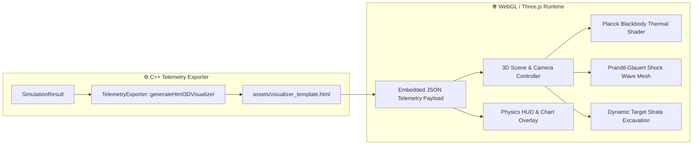

# 3. 3D WebGL Visualizer

// Copyright (c) 2026 Omid Teimory. All Rights Reserved.

---

## 🎨 Overview & Purpose

The **3D WebGL Physics Visualizer** is a high-performance, browser-based rendering application that visualizes the complete multi-phase telemetry generated by the C++ simulation engine.

Generated as a standalone HTML file (`3d_visualizer.html`) or served via the Node.js web dashboard, the visualizer provides real-time, frame-by-frame 3D playback of aerodynamic drop trajectories, supersonic shock waves, crater excavation, and subterranean penetration.

---

## ✨ Key Visualizer Features

1. **Deterministic Telemetry Animation**:
   - Driven directly by sub-millisecond timestamps, altitudes, depths, velocities, and $g$-forces recorded in `drop_frames` and `penetration_frames`.
   - Variable playback speed controls ($0.1\times$ slow-motion to $10\times$ high-speed).

2. **Planck Blackbody Thermal Radiation**:
   - Casing temperature elevations from frictional shear work ($\dot{Q}_{fric}$) dynamically shift the penetrator's material emission color from dull red ($800\text{ K}$) through bright orange and yellow to white-hot plasma ($2200\text{ K}+$):

   $$\text{Planck Emission Color: } T < 800\text{ K} \rightarrow \text{Steel}, \quad 800\text{--}1400\text{ K} \rightarrow \text{Incandescent Red/Orange}, \quad > 1800\text{ K} \rightarrow \text{Plasma}$$

3. **Prandtl-Glauert Supersonic Shock Cones**:
   - When projectile velocity exceeds local atmospheric speed of sound ($M > 1.0$), a 3D Mach shock cone is attached to the nose with half-angle $\alpha = \arcsin(1/M)$, dynamically scaling with velocity changes.

4. **Multi-Layer Stratified Target Excavation**:
   - Renders 3D cross-sectional cutaways of complex geological strata (topsoil, granite, reinforced concrete layers) and animates crater widening and borehole tunneling.

5. **Integrated Glassmorphism Telemetry HUD**:
   - Real-time diagnostic readouts displaying instantaneous velocity, Mach number, deceleration $g$-forces, Dynamic Increase Factors (DIF), and instantaneous shock energy.

---

## 🧭 Subsections

* [3.1 Visualizer Architecture & Rendering Pipeline](03-01-visualizer-architecture-and-pipeline.md)
* [3.2 Visualizer Performance & Optimization](03-02-visualizer-performance-and-optimization.md)
