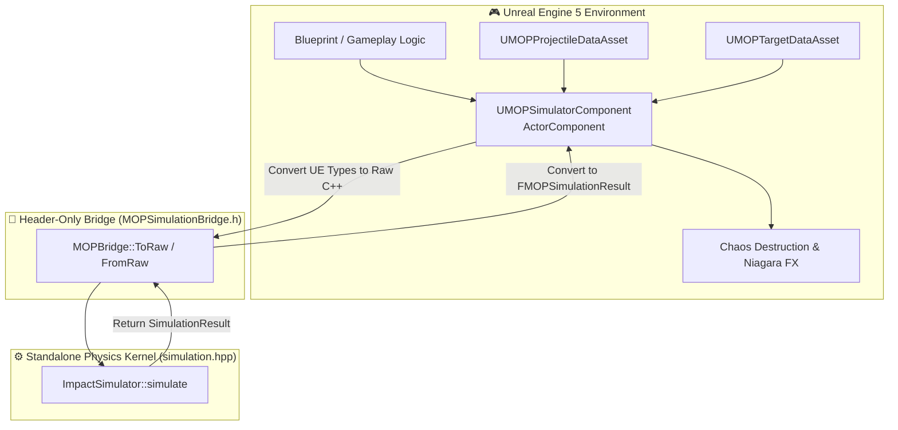

# 4. Unreal Engine Integration (`UnreaEngine`)

// Copyright (c) 2026 Omid Teimory. All Rights Reserved.

---

## 🎮 Overview & Capabilities

The **Unreal Engine Integration Module** (`UnreaEngine`) bridges the high-performance C++23 continuum mechanics kernel directly into **Unreal Engine 5 (UE5)**. 

This enables defense researchers, aerospace simulation developers, and technical artists to execute deterministic terminal ballistics simulations within UE5, driving Niagara particle FX, Chaos destruction meshes, real-time cinematics, and interactive Blueprint game modes.

---

## ✨ Key Integration Features

1. **Zero-Overhead Header-Only Bridge**:
   `MOPSimulationBridge.h` provides inline translation between Unreal Engine `USTRUCT`s (`FMOPProjectile`, `FMOPTarget`, `FMOPSimulationResult`) and standard C++ structs, requiring zero external compilation dependencies.

2. **Asynchronous Execution & Multithreading**:
   `UMOPSimulatorComponent` supports non-blocking execution via `FNonAbandonableTask` / `Async(EAsyncExecution::ThreadPool)`, keeping game-thread frame rates at native 60–120 FPS during heavy multi-thousand step integration sweeps.

3. **DataAsset Preset Management**:
   Weapons and target geometries are defined as native Unreal DataAssets (`UMOPProjectileDataAsset`, `UMOPTargetDataAsset`), allowing designers to configure and tweak penetration parameters directly inside the Unreal Editor.

4. **Chaos Destruction & Physics Sync**:
   Subterranean crater depths, dynamic pressure, and velocity vectors map directly into Unreal Engine's Chaos Physics and Niagara visual effect systems for realistic ground fracturing and shock wave propagation.

---

## 🧭 Subsections

* [4.1 UE Module Structure & Build Configuration](04-01-ue-module-structure-and-build.md)
* [4.2 UE Types, Components & Bridge](04-02-ue-types-components-and-bridge.md)
