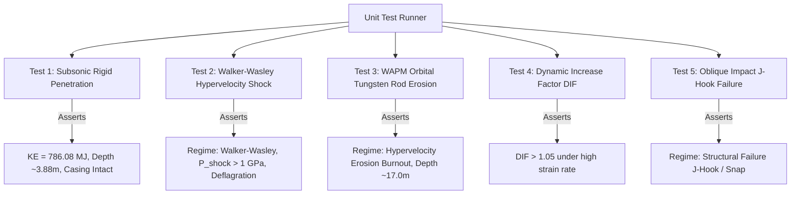

# 5.1 C++ Test Suite

// Copyright (c) 2026 Omid Teimory. All Rights Reserved.

---

## ⚡ Test Suite Overview (`tests/test_simulation.cpp`)

The native C++ simulation test suite executes automated regression tests against known analytical baselines, validating every physical formulation implemented in the kernel.

### Running the Test Suite:

```powershell
cd backend

# Compile and run all unit tests
mingw32-make test

# Or run via the compiled binary flag
./bin/mop_sim.exe --test
```

---

## 🔬 Test Case Breakdown



---

### Test 1: Subsonic Operational Impact ($340\text{ m/s}$)
* **Objective**: Validates the standard operational delivery envelope of the GBU-57 MOP against reinforced concrete.
* **Physical Assertions**:
  1. Kinetic energy matches theoretical calculation ($E_k = \frac{1}{2} m v^2 = 786.08\text{ MJ}$).
  2. Casing remains intact (`casing_failure == false`) and explosive charge survives.
  3. Correctly identifies regime: `Rigid Penetration (Crater+Tunnel)`.
  4. Continuity between Phase I cratering ($z < 2D$) and Phase II tunneling ($z \ge 2D$).
  5. Final penetration depth is within validated tolerance ($3.5\text{ m} < z < 4.5\text{ m}$, benchmark: $3.88\text{ m}$).

---

### Test 2: Hypervelocity Shock Initiation ($5000\text{ m/s}$)
* **Objective**: Validates that extreme impact shock pressures exceed the Walker-Wasley critical energy threshold ($P^2\tau \ge E_c$).
* **Physical Assertions**:
  1. Identifies regime: `Shock Initiation (Walker-Wasley)`.
  2. Casing failure or explosive deflagration is flagged (`!explosive_charge_survives`).
  3. Shock damage probability exceeds $99\%$.
  4. Peak shock pressure correctly captures Hugoniot EOS impedance jump ($P_{shock} > 1.0\text{ GPa}$).

---

### Test 3: Orbital Kinetic Strike (Tungsten Rod from LEO, $3400\text{ m/s}$)
* **Objective**: Validates the **Walker-Anderson Penetration Model (WAPM)** for non-explosive kinetic penetrators.
* **Physical Assertions**:
  1. Munition identified as kinetic rod (`is_kinetic_rod == true`).
  2. Identifies regime: `Hypervelocity Erosion Burnout`.
  3. Hydrodynamic erosion active (`erosion_occurred == true` and `erosion_length_lost > 0.0`).
  4. Final rod length is less than initial length ($L_{final} < L_0$).
  5. Penetration depth matches Alekseevskii-Tate hydrodynamic scaling ($16.0\text{ m} < z < 18.0\text{ m}$, benchmark: $17.0\text{ m}$).

---

### Test 4: Dynamic Increase Factor (DIF) Validation
* **Objective**: Validates that strain-rate dependent concrete strengthening scales properly during rapid deceleration.
* **Physical Assertions**:
  1. Telemetry frames reflect dynamic increase scaling ($\text{DIF} > 1.05$).
  2. Final result confirms dynamic strengthening multiplier ($\text{DIF}_{max} > 1.0$).

---

### Test 5: Oblique Impact & J-Hook Snapping
* **Objective**: Validates structural failure mechanics when munitions strike concrete at high obliquity angles ($30^\circ$ obliquity, $5^\circ$ angle of attack, $400\text{ m/s}$).
* **Physical Assertions**:
  1. Asymmetric lateral forces generate bending moments exceeding casing section modulus.
  2. Identifies regime: `Structural Failure (J-Hook/Snap)`.
  3. Casing failure flagged (`casing_failure == true`).

---

## 🧭 Navigation

* [Back to 5. Testing & Quality Assurance](05-testing-and-quality-assurance.md)
* [Proceed to 5.2 Code Style & Formatting Standards](05-02-code-style-and-formatting-standards.md)
* [Explore 2.1.1 Physics Models & Numerical Methods](02-01-01-physics-models-and-numerical-methods.md)
