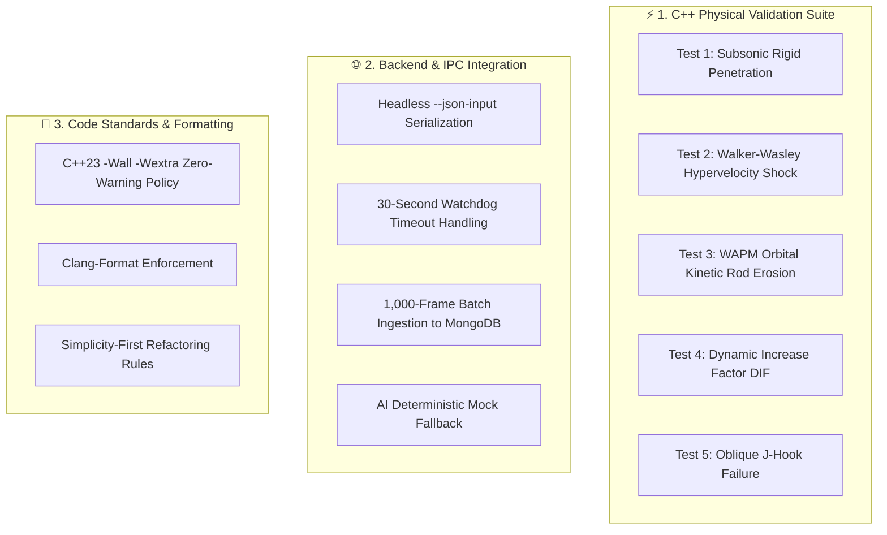

# 5. Testing & Quality Assurance

// Copyright (c) 2026 Omid Teimory. All Rights Reserved.

---

## 🧪 Testing Philosophy & QA Strategy

The **MOP Simulator** enforces a rigorous multi-tier testing framework to ensure physical accuracy, numerical stability, and high software reliability across all native C++ algorithms and Node.js backend services.

---

## 🎯 Verification Pillars

1. **Deterministic Physical Invariants**:
   - Total energy conservation checks across atmospheric drop phases.
   - Strict adherence to published ballistics literature (Forrestal, Alekseevskii-Tate, Walker-Wasley, CEB-FIP).
   - Assertion testing against known baseline depths for standard targets.

2. **Process Resilience & IPC Safety**:
   - Zero process hangs or memory leaks during high-frequency telemetry streaming.
   - Comprehensive error recovery when database connections or external AI APIs experience latency.

3. **Continuous Code Quality**:
   - Clean compilation under `-Wall -Wextra -std=c++23`.
   - Strict linting and formatting via `.clang-format` and `.prettierrc`.

---

## 🧭 Subsections

* [5.1 C++ Test Suite](05-01-cpp-test-suite.md)
* [5.2 Code Style & Formatting Standards](05-02-code-style-and-formatting-standards.md)
