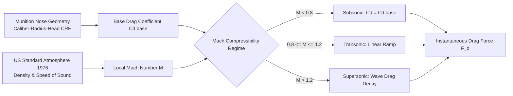

# 6.2 Ballistic Drag Model References

// Copyright (c) 2026 Omid Teimory. All Rights Reserved.

---

## 🚀 Aerodynamic Drag & Compressibility Physics

The aerodynamic trajectory calculation in **MOP Simulator** accurately integrates aerodynamic drag across subsonic, transonic, and supersonic regimes.

---

## 📐 1. Caliber-Radius-Head (CRH) Geometry

The **Caliber-Radius-Head (CRH)** is a non-dimensional ratio defining the sharpness and tangent ogive geometry of a projectile nose:

$$\text{CRH} = \frac{R_{nose}}{D}$$

Where $R_{nose}$ is the radius of curvature of the ogive profile and $D$ is the body diameter.

### Base Drag Coefficient:
For a tangent ogive nose in incompressible flow, the baseline pressure drag coefficient is:

$$C_{d,\text{base}} = \frac{8 \cdot \text{CRH} - 1}{24 \cdot \text{CRH}^2}$$

For standard munitions:
* **GBU-57 MOP**: $\text{CRH} \approx 6.0 \rightarrow C_{d,\text{base}} \approx 0.054$
* **BLU-109**: $\text{CRH} \approx 3.0 \rightarrow C_{d,\text{base}} \approx 0.106$

---

## 💨 2. Mach Compressibility Regimes

Compressibility effects modulate drag as projectile speed approaches and exceeds the speed of sound ($M = v / c$):

$$C_d(M) = \begin{cases} 
C_{d,\text{base}} & M < 0.8 \\
C_{d,\text{base}} \cdot \left[1 + 2.5(M - 0.8)\right] & 0.8 \le M \le 1.2 \\
\frac{C_{d,\text{base}}}{\sqrt{M^2 - 1}} + \Delta C_{d,\text{wave}} & M > 1.2
\end{cases}$$

Where $\Delta C_{d,\text{wave}} \approx \frac{0.1}{\text{CRH}}$ represents trailing base suction and shock wave dissipation.

---

## 🌍 3. US Standard Atmosphere (1976) Equations

Ambient atmospheric conditions are evaluated dynamically as a function of altitude $y$:

$$\text{Temperature Lapse (Troposphere): } T(y) = 288.15 - 0.0065 \cdot y \quad (\text{K})$$

$$\text{Barometric Pressure: } P(y) = 101325 \cdot \left(\frac{T(y)}{288.15}\right)^{\frac{g \cdot M_{air}}{R \cdot L}} \quad (\text{Pa})$$

$$\text{Air Density: } \rho_{air}(y) = \frac{P(y) \cdot M_{air}}{R \cdot T(y)} \quad (\text{kg/m}^3)$$

$$\text{Speed of Sound: } c(y) = \sqrt{1.4 \cdot \frac{R}{M_{air}} \cdot T(y)} \quad (\text{m/s})$$

---

## 📐 4. Obliquity Angle & Coordinate Frames

* **Obliquity Angle ($\theta$)**: The angle measured between the projectile's velocity vector $\vec{v}$ and the inward target surface normal vector $\hat{n}$. A normal (perpendicular) strike corresponds to $\theta = 0^\circ$.
* **Angle of Attack ($\alpha$)**: The angular deviation between the projectile's longitudinal center-line axis and its instantaneous velocity vector. Non-zero $\alpha$ creates significant lateral yaw moments and increases target entry crater diameter.
* **Obliquity in Radians**:
  $$\theta_{rad} = \theta_{deg} \cdot \left(\frac{\pi}{180}\right)$$

---

## 🧭 Navigation

* [Back to 6. Reference Materials & Research Papers](06-reference-materials-and-research-papers.md)
* [Proceed to 7. Glossary](07-glossary.md)
* [Explore 2.1.1 Physics Models & Numerical Methods](02-01-01-physics-models-and-numerical-methods.md)
