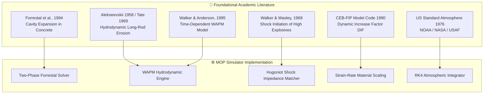

# 6. Reference Materials & Research Papers

// Copyright (c) 2026 Omid Teimory. All Rights Reserved.

---

## 📚 Academic & Literature Foundations

The physical formulations in **MOP Simulator** are derived from peer-reviewed literature in terminal ballistics, shock wave physics, continuum mechanics, and high-strain-rate material dynamics.

---

## 📑 Core Citations & Research Bibliography

1. **Forrestal, M. J., Altman, B. S., Cargile, J. D., & Hanchak, S. J. (1994)**. *An empirical formula for penetration of ogive-nose projectiles into concrete targets*. International Journal of Impact Engineering, 15(4), 395–405.
2. **Alekseevskii, V. P. (1958)**. *Penetration of a rod into a target at high velocity*. Combustion, Explosion, and Shock Waves, 2(2), 63–66.
3. **Tate, A. (1969)**. *A theory for the deceleration of long rods after impact*. Journal of the Mechanics and Physics of Solids, 17(3), 141–150.
4. **Walker, J. D., & Anderson, C. E. (1995)**. *A time-dependent model for long-rod penetration*. International Journal of Impact Engineering, 16(1), 19–48.
5. **Walker, F. E., & Wasley, R. J. (1969)**. *Critical energy for shock initiation of secondary explosives*. Explosivstoffe, 17(1), 9–13.
6. **Comité Euro-International du Béton (CEB-FIP)**. (1993). *CEB-FIP Model Code 1990: Design Code*. Thomas Telford Services Ltd.
7. **National Oceanic and Atmospheric Administration (NOAA), NASA, USAF**. (1976). *U.S. Standard Atmosphere, 1976*. NOAA-S/T 76-1562.

---

## 📄 Project Research Publications

The platform includes formal research papers documenting its methodology and findings:

* **[MOP Simulator Research Paper](file:///h:/Omid/Code/MOP-Simulator/backend/documents/MOP_Simulator_Research_Paper.md)**: *"Autonomous Computational Framework for Multi-Phase Impact Dynamics and Terminal Ballistics in Reinforced Geomaterials"*.
* **Operation Midnight Hammer Paper (`backend/paper/MidnightHammer.tex`)**: Investigates sequential multi-bomb salvo penetration mechanics against deeply buried nuclear centrifuge facilities.

---

## 🧭 Subsections

* [6.1 Physics Reference Documents](06-01-physics-reference-documents.md)
* [6.2 Ballistic Drag Model References](06-02-ballistic-drag-model-references.md)
