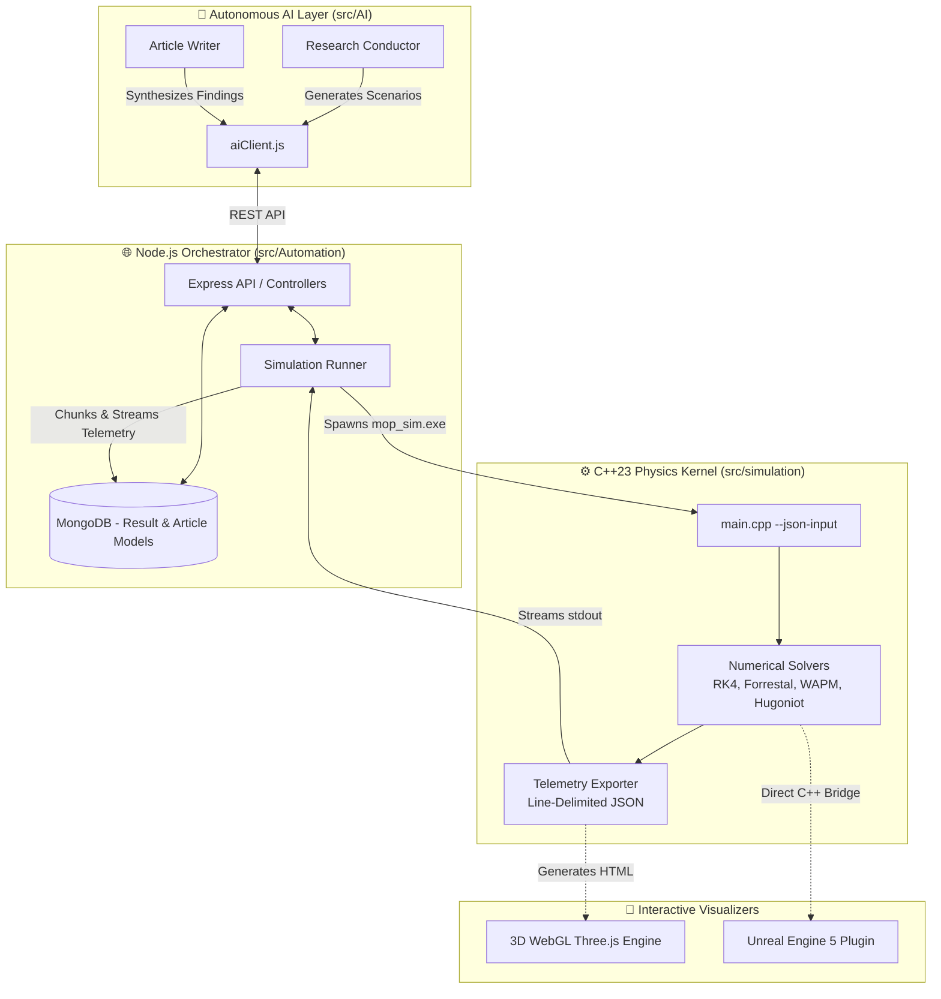

# MOP Simulator Documentation

Welcome to the official documentation for **MOP Simulator V3.5.0** — an autonomous AI penetration research platform and high-fidelity terminal ballistics continuum mechanics engine.

---

## 📚 Table of Contents

### 1. [Project Overview](01-overview.md)
* [1.1 Getting Started](01-01-getting-started.md)
* [1.2 Project Roadmap & Contribution Guide](01-02-roadmap-and-contribution.md)

### 2. [System Architecture](02-system-architecture.md)
* [2.1 C++ Physics Engine (`src/simulation`)](02-01-cpp-physics-engine.md)
  * [2.1.1 Physics Models & Numerical Methods](02-01-01-physics-models-and-numerical-methods.md)
  * [2.1.2 Data Structures & Configuration Schema](02-01-02-data-structures-and-config-schema.md)
* [2.2 Node.js Automation Layer (`src/Automation`)](02-02-nodejs-automation-layer.md)
  * [2.2.1 REST API Endpoints & Controllers](02-02-01-rest-api-endpoints-and-controllers.md)
  * [2.2.2 Services: SimulationRunner & ArticleWriter](02-02-02-services-simulation-runner-and-article-writer.md)
  * [2.2.3 MongoDB Data Models](02-02-03-mongodb-data-models.md)
* [2.3 AI Orchestrator Layer (`src/AI`)](02-03-ai-orchestrator-layer.md)

### 3. [3D WebGL Visualizer](03-3d-webgl-visualizer.md)
* [3.1 Visualizer Architecture & Rendering Pipeline](03-01-visualizer-architecture-and-pipeline.md)
* [3.2 Visualizer Performance & Optimization](03-02-visualizer-performance-and-optimization.md)

### 4. [Unreal Engine Integration (`UnreaEngine`)](04-unreal-engine-integration.md)
* [4.1 UE Module Structure & Build Configuration](04-01-ue-module-structure-and-build.md)
* [4.2 UE Types, Components & Bridge](04-02-ue-types-components-and-bridge.md)

### 5. [Testing & Quality Assurance](05-testing-and-quality-assurance.md)
* [5.1 C++ Test Suite](05-01-cpp-test-suite.md)
* [5.2 Code Style & Formatting Standards](05-02-code-style-and-formatting-standards.md)

### 6. [Reference Materials & Research Papers](06-reference-materials-and-research-papers.md)
* [6.1 Physics Reference Documents](06-01-physics-reference-documents.md)
* [6.2 Ballistic Drag Model References](06-02-ballistic-drag-model-references.md)

### 7. [Glossary](07-glossary.md)

---

## 🏛️ High-Level Ecosystem Map

---

## 📖 Suggested Reading Pathways

* **For New Developers:** Start with [1. Project Overview](01-overview.md) and [1.1 Getting Started](01-01-getting-started.md).
* **For Physicists & Ballistics Researchers:** Review [2.1.1 Physics Models & Numerical Methods](02-01-01-physics-models-and-numerical-methods.md) and [6. Reference Materials](06-reference-materials-and-research-papers.md).
* **For Web & Full-Stack Engineers:** Review [2.2 Node.js Automation Layer](02-02-nodejs-automation-layer.md) and [3. 3D WebGL Visualizer](03-3d-webgl-visualizer.md).
* **For Game Engine Integrators:** Review [4. Unreal Engine Integration](04-unreal-engine-integration.md).
