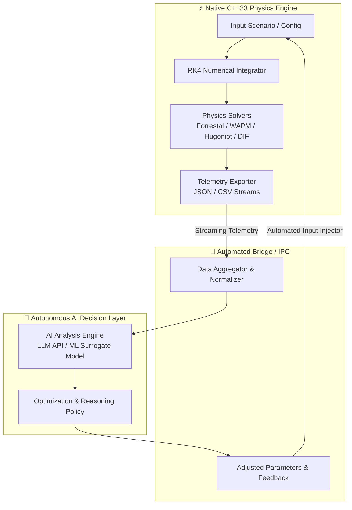

# 🧠 AI Integration & Closed-Loop Autonomous Simulation

> **Architecture & Roadmap Document**  
> *MOP Simulator — High-Fidelity Terminal Ballistics & Penetration Engine*

---

## 📌 Executive Summary

The **AI Integration Module** enables a high-level, self-managing closed loop between the native C++23 physics engine and external AI/ML models. By feeding real-time numerical telemetry (RK4 integration frames, deceleration curves, stress tensors, thermal cook-off margins) into AI reasoning and optimization agents, the system autonomously adjusts simulation parameters, searches multi-dimensional parameter spaces, detects physical anomalies, and runs automated target penetration campaigns.



---

## 🔄 Closed-Loop Lifecycle: The 4-Phase Feedback Cycle

```
  ┌─────────────────────────────────────────────────────────────┐
  │                                                             │
  ▼                                                             │
[Phase 1: Ingest & Feed] ──► [Phase 2: Evaluate & Infer]        │ (Closed Loop)
                                      │                         │
                                      ▼                         │
[Phase 4: Self-Manage]   ◄── [Phase 3: Optimize & Adjust]       │
  │                                                             │
  └─────────────────────────────────────────────────────────────┘
```

### 1. Ingest & Telemetry Feed (`C++ ➔ AI`)
* **Real-time Telemetry Serialization**: Serializes high-frequency penetration frames, transient shock pressures, strain-rate dynamic increase factors (DIF), and projectile erosion.
* **Feature Extraction**: Distills million-timestep simulation runs into compact, meaningful statistical vectors (peak deceleration, time-to-critical-failure, crater-to-tunnel transition efficiency).

### 2. Intelligent Evaluation & Inference (`AI Processing`)
* **Physical Plausibility Check**: Compares empirical ballistic databases with simulation output to spot boundary violations.
* **Failure Mode Classification**: Identifies structural casing snap (J-Hooking), hydrodynamic erosion burnout, or premature shock initiation (Walker-Wasley criteria).
* **Sensitivity Analysis**: Computes gradients across variables (e.g., impact obliquity, velocity vs. final depth).

### 3. Parameter Optimization & Decision (`AI ➔ Strategy`)
* **Adaptive Goal Seeking**: Automatically searches for the optimal delivery envelope (e.g., maximum depth without exceeding casing yield strength).
* **Sequential Salvo Planning**: Intelligently schedules multi-strike trajectories where each successive impact leverages the pre-damaged rubble and degraded target resistance from prior strikes.

### 4. Self-Management & Autonomous Loop Execution
* **Automated Re-simulation**: Injects computed optimization parameters back into `data/scenarios.json` or pipes them directly via CLI/IPC.
* **Convergence Verification**: Evaluates whether the system reached global optima or target threshold criteria, terminating gracefully when solved.

---

## 🛠️ Data Exchange Specifications

### Outbound AI Telemetry Payload (`telemetry_payload.json`)

```json
{
  "simulation_id": "sim_20260814_001_opt",
  "status": "COMPLETED",
  "projectile": {
    "name": "GBU-57 MOP",
    "mass_kg": 13600.0,
    "diameter_m": 0.8,
    "nose_caliber_radius": 2.5
  },
  "target": {
    "material": "Ultra-High-Performance Concrete (UHPC)",
    "unconfined_compressive_strength_mpa": 140.0,
    "density_kg_m3": 2400.0
  },
  "metrics": {
    "impact_velocity_ms": 450.0,
    "final_penetration_depth_m": 18.42,
    "max_deceleration_g": 8420.5,
    "peak_dynamic_pressure_gpa": 2.14,
    "casing_intact": true,
    "explosive_survived": true,
    "failure_mode": "NONE"
  }
}
```

### Inbound AI Decision & Control Directive (`ai_directive.json`)

```json
{
  "action": "ITERATE_OPTIMIZATION",
  "target_objective": "MAXIMIZE_DEPTH_PRESERVE_CASING",
  "next_parameters": {
    "impact_velocity_ms": 485.0,
    "angle_of_attack_deg": 1.2,
    "obliquity_deg": 4.5
  },
  "confidence_score": 0.962,
  "rationale": "Increasing velocity by 35 m/s increases kinetic energy by 16% while peak bending moment remains 8.4% below shear threshold."
}
```

---

## 🎯 Target Use Cases

| Capability | Purpose | Benefit |
| :--- | :--- | :--- |
| **Autonomous Salvo Optimizer** | Optimizes multi-bomb sequential drops into hardened multi-layered bunkers. | Maximizes structural damage with minimal ordnance. |
| **Envelope Stress Search** | Stress-tests projectile geometries against extreme impact velocities (Mach 3–15). | Rapidly maps safe vs. catastrophic structural failure zones. |
| **AI Physics Surrogate Model** | Learns from high-fidelity RK4 runs to provide millisecond-fast depth approximations. | Enables real-time strategy calculations in downstream software. |
| **Self-Healing Experimentation** | Automatically re-runs simulations with refined time-step `dt` if numerical instability occurs. | Zero human intervention required during massive parametric test runs. |

---

## 🗺️ Implementation Roadmap

- [ ] **Phase 1: Structured Telemetry Standard**
  - Standardize JSON telemetry schema across all simulation modules.
  - Implement low-overhead streaming exporter for real-time IPC.
- [ ] **Phase 2: Python / Node.js AI Connector Bridge**
  - Develop lightweight middleware connecting simulator outputs to LLM / ML API endpoints.
  - Create bi-directional CLI daemon for headless input injection.
- [ ] **Phase 3: Autonomous Closed-Loop Optimizer**
  - Implement feedback loops for parameter exploration and convergence tracking.
  - Add safety guardrails to prevent infinite simulation loops or unphysical inputs.
- [ ] **Phase 4: ML Surrogate & Predictive Analytics**
  - Train compact neural network surrogates directly from accumulated historical simulation datasets.
