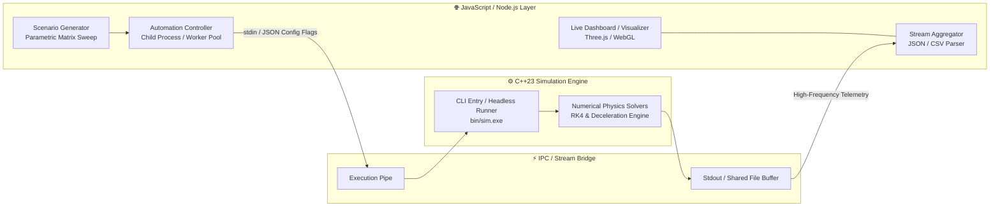

# ⚡ JavaScript + C++ Data Input & Output Automation Pipeline

> **Architecture & Engineering Guide**  
> *MOP Simulator — High-Speed Native Core with Automated Web/Node.js Orchestration*

---

## 📌 Executive Overview

This document outlines the **automation architecture bridging the high-performance C++23 native simulation engine with modern JavaScript/TypeScript ecosystems** (Node.js, WebGL 3D Visualizer, Electron, and Automated Test Runners). 

By automating bidirectional data flow, the system eliminates manual scenario setup, executes massive headless parametric sweeps, and provides real-time streaming telemetry directly into interactive dashboards and data pipelines.



---

## 🔁 Automated Pipeline Architecture

```
  [JavaScript Automation Harness]
         │
         ▼  (1) Generates & injects scenario matrices / JSON payloads
  [C++ Simulation Engine (bin/sim.exe)]
         │
         ▼  (2) Executes sub-millisecond numerical integration
  [Telemetry Stream (JSON / CSV)]
         │
         ▼  (3) Automates ingestion, validation & aggregation
  [WebGL 3D Visualizer / Analytics Reports]
```

### 1. Automated Input Generation (`JS ➔ C++`)
* **Matrix Sweeps**: JavaScript scripts dynamically generate thousands of permutations (varying velocity, strike angle, target hardness, and projectile nose shapes).
* **Validation & Formatting**: Validates schema against strict constraints before passing configurations into `data/scenarios.json` or through command-line pipes.
* **Non-Interactive Headless Mode**: Triggers C++ executions silently in the background with flags like `--headless --config scenario.json --output-format json`.

### 2. Execution & Multi-Process Worker Pooling
* **Node.js Child Process Pool**: Spawns multiple parallel instances of `bin/sim.exe` across CPU cores for high-throughput batch experimentation.
* **Lifecycle & Error Handling**: Monitors exit codes, memory footprints, and timeouts to guarantee robust crash recovery and leak-free execution.

### 3. Automated Output Ingestion (`C++ ➔ JS`)
* **High-Throughput Streaming**: Reads stdout line-delimited JSON or memory-mapped files without disk I/O bottlenecks.
* **Frame Parsing & Interpolation**: Decodes trajectory waypoints, deceleration loads, and material erosion arrays for immediate consumption.

### 4. Automated Export & Interactive Visualization
* **Dynamic WebGL Generation**: Automatically compiles simulation outputs into standalone interactive 3D HTML reports (via Three.js).
* **Automated Data Export**: Exports synchronized CSV tables, analytical summary cards, and raw telemetry bundles for academic papers or external analysis.

---

## 🔌 Inter-Process Communication (IPC) Protocol

### 1. Headless CLI Command Interface
```bash
# Automated Single Run
./bin/sim.exe --headless --scenario "data/scenarios/salvo_test.json" --output "build/telemetry.json"

# Automated Matrix Batch Mode
node scripts/automate_sweep.js --targets "UHPC,Granite" --velocities "300,450,600,1200" --workers 8
```

### 2. Streaming Node.js Integration Example

```javascript
import { spawn } from 'child_process';
import readline from 'readline';

/**
 * Executes an automated simulation run and streams real-time telemetry frames.
 * @param {Object} scenarioConfig - Target and projectile parameters
 * @returns {Promise<Object>} Final simulation result
 */
export async function runAutomatedSimulation(scenarioConfig) {
  return new Promise((resolve, reject) => {
    const simProcess = spawn('./bin/sim.exe', [
      '--headless',
      '--json-input', JSON.stringify(scenarioConfig)
    ]);

    const rl = readline.createInterface({ input: simProcess.stdout });
    const frames = [];

    rl.on('line', (line) => {
      try {
        const message = JSON.parse(line);
        if (message.type === 'FRAME') {
          frames.push(message.data);
        } else if (message.type === 'RESULT') {
          resolve({ summary: message.data, frames });
        }
      } catch (err) {
        // Non-JSON debug logs
      }
    });

    simProcess.stderr.on('data', (data) => console.error(`[C++ Error]: ${data}`));
    simProcess.on('close', (code) => {
      if (code !== 0) reject(new Error(`Process exited with code ${code}`));
    });
  });
}
```

---

## 📊 Key Automation Features & Benefits

| Automation Feature | Implementation Mechanism | Benefit |
| :--- | :--- | :--- |
| **Parametric Sweeps** | Node.js asynchronous worker pool spawning parallel C++ instances | Runs 10,000+ simulation variants in minutes. |
| **Real-Time Visualizer Feed** | WebSocket or local file streaming to `3d_visualizer.html` | Instantaneous 3D render updates upon simulation completion. |
| **Automated Benchmark Suite** | Integration tests checking regression against baseline outputs | Guarantees numerical precision across physics updates. |
| **Unified Data Schema** | Standardized JSON serialization across both C++ and JavaScript | Single source of truth with zero manual data conversion. |

---

## 🗺️ Engineering Milestones

- [ ] **Milestone 1: Headless CLI & Direct JSON Pipe in C++**
  - Add `--headless` and `--json-input` arguments to `src/simulation/main.cpp`.
  - Enable direct JSON stdout streaming mode.
- [ ] **Milestone 2: Node.js Automation Runner**
  - Implement batch scenario generator in JavaScript.
  - Implement worker queue for parallel execution management.
- [ ] **Milestone 3: Automated Visualizer Bridge**
  - Automatically update `3d_visualizer.html` with newly generated telemetry via headless script.
  - Add instant export capabilities (GLTF 3D model, CSV, PDF summary).
- [ ] **Milestone 4: CI/CD Automated Regression Testing**
  - Automate physics validation checks on every commit via GitHub Actions.
